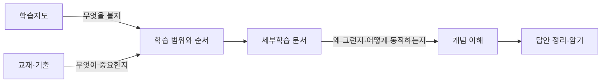
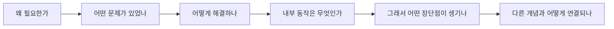
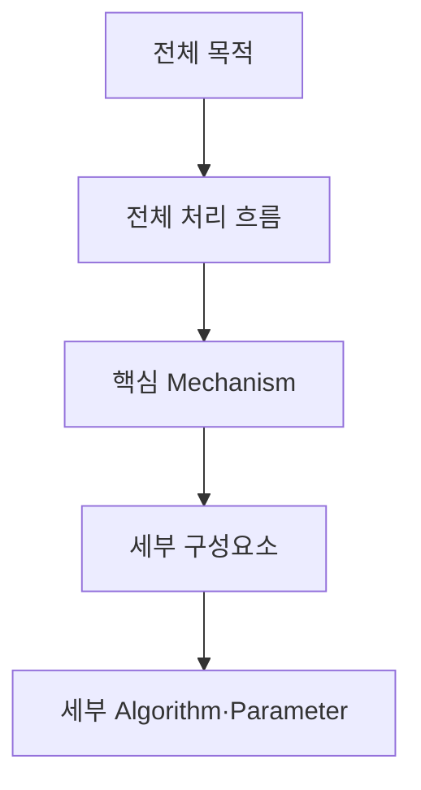
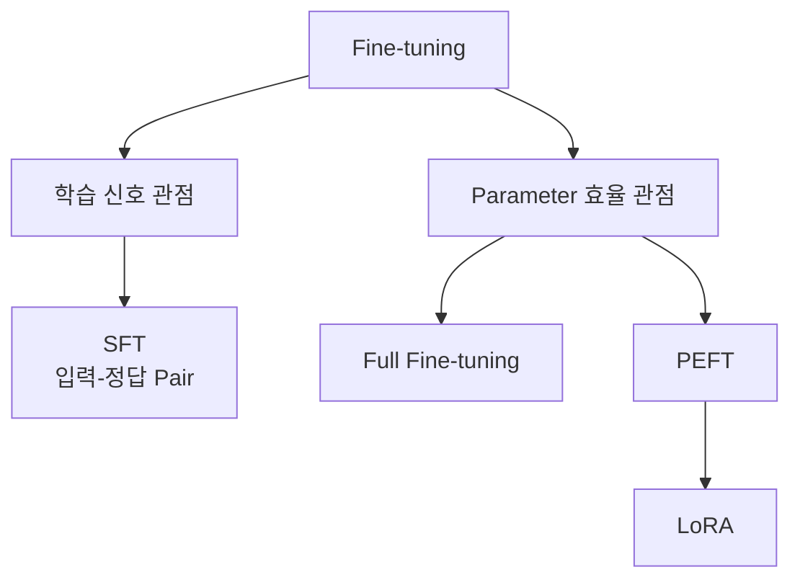
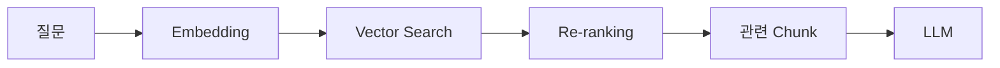
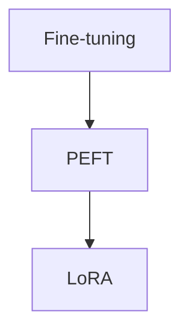
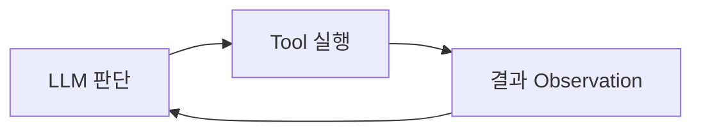
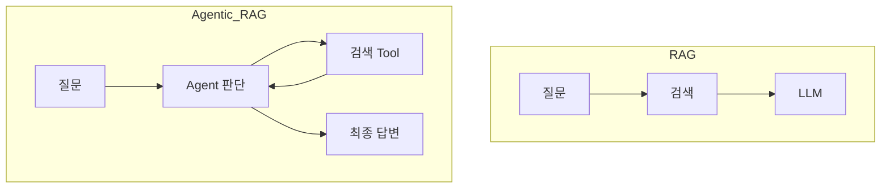
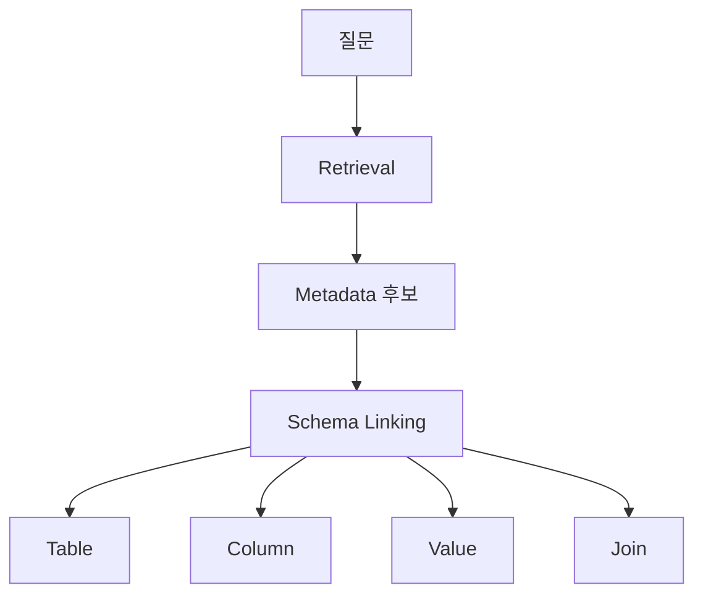
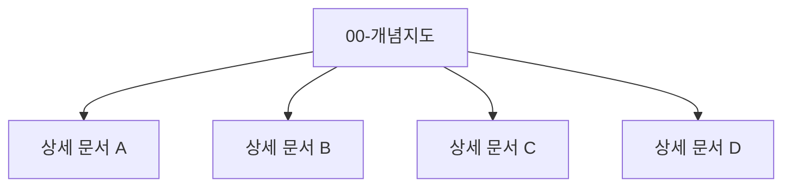

# 정보관리기술사 세부학습 작성 규칙

이 문서는 `_archive/license/정보관리기술사/세부학습/` 아래에 작성하는 세부학습 문서의 공통 기준이다.

세부학습 문서의 목적은 **시험 직전 암기용 요약본을 만드는 것이 아니라, 학습 과정에서 이해한 내용을 나중에 다시 읽었을 때 그 이해가 복원되도록 남기는 것**이다.

학습지도·교재 목차·기출문제 분석 문서와 역할을 구분한다.



---

# 1. 세부학습 문서의 역할

세부학습 문서는 다음 질문에 답할 수 있어야 한다.

```text
이 개념은 왜 필요한가?
무엇을 해결하는가?
내부적으로 어떻게 동작하는가?
앞뒤 개념과 어떤 관계인가?
비슷한 개념과 무엇이 다른가?
실제 시스템에서는 어디에 위치하는가?
내가 처음 배울 때 왜 헷갈렸는가?
```

단순히 다음처럼 키워드만 나열하는 문서는 지양한다.

```text
RAG
- Retrieval-Augmented Generation
- Embedding
- Vector DB
- LLM
```

대신 개념의 인과관계를 설명한다.

```text
LLM에 모든 사내 문서를 넣을 수 없음
        ↓
질문과 관련 있는 부분만 먼저 찾아야 함
        ↓
문서를 검색 가능한 Vector로 표현
        ↓
Vector Search로 관련 Chunk 검색
        ↓
검색된 원문을 LLM Context에 전달
        ↓
RAG
```

> **세부학습 문서는 키워드를 저장하는 곳이 아니라, 키워드 사이의 연결을 저장하는 곳이다.**

---

# 2. 가장 중요한 원칙: 이해가 됐던 설명을 버리지 않는다

대화나 학습 과정에서 처음에는 이해되지 않던 개념이 특정 설명·비유·예제를 통해 이해됐다면 그 부분은 세부학습 문서에서 중요한 내용이다.

예를 들어 최종적으로 다음 문장만 남기는 것은 부족하다.

```text
MCP는 AI Application과 Tool 간 표준 Protocol이다.
```

학습 과정에서 다음 설명을 통해 이해했다면 함께 보존한다.

```text
Agent가 외부 Tool을 사용하려면
- 어떤 Tool이 있는지
- 무슨 기능인지
- 어떤 Parameter가 필요한지
- 어떻게 호출하는지
알아야 한다.

MCP는 이 'Tool 지도와 사용법'을 공통 규격으로 제공한다.
```

즉 **대화에서 “아, 이제 이해됐다”가 나온 설명은 압축 과정에서 우선적으로 보존한다.**

---

# 3. 정의보다 `왜 → 어떻게 → 그래서`를 우선한다

문서의 기본 사고 흐름은 다음을 권장한다.



예를 들어 HNSW를 작성한다면:

1. Vector 전수 비교가 왜 느린가
2. ANN이 왜 필요한가
3. HNSW는 어떤 아이디어로 탐색 범위를 줄이는가
4. 왜 빠르고 Recall이 높은가
5. 왜 Memory와 Index 구축 비용이 커지는가
6. IVF와 무엇이 다른가

순으로 설명하면 이해가 오래 남는다.

---

# 4. 문서의 권장 기본 구조

모든 문서를 똑같은 Template으로 강제할 필요는 없지만 다음 구조를 기본으로 삼는다.

```text
# 주제

이 문서에서 무엇을 이해하려는지 2~4문장

## 1. 왜 필요한가 / 가장 먼저 잡을 핵심

## 2. 전체 흐름

## 3. 핵심 구성요소 또는 내부 동작

## 4. 처음 헷갈리기 쉬운 부분

## 5. 유사 개념과 비교

## 6. 실제 적용 또는 예제

## 7. 장단점·Trade-off·운영 고려사항

## 8. 기억 흐름
```

주제 특성에 따라 일부 Section은 생략·변경한다.

---

# 5. 먼저 큰 그림을 보여주고 세부로 내려간다

새로운 개념을 바로 세부 용어부터 설명하지 않는다.

예:

```text
잘못된 시작
Q/K/V 정의 → Scaled Dot Product → Multi-head → ...

권장 시작
Transformer는 Token Vector에 문맥을 반영한다.
그 과정에서 어떤 Token을 얼마나 참고할지 계산하는 핵심 Mechanism이 Attention이다.
그 Attention 계산을 구현하기 위해 Q/K/V가 등장한다.
```

즉:



상위 개념을 이해한 뒤 하위 개념으로 내려간다.

---

# 6. 처리 과정은 가능하면 `입력 → 처리 → 출력`으로 표현한다

동작 원리를 설명할 수 있는 주제는 다음 구조를 적극 사용한다.

```text
입력
→ 처리 1
→ 처리 2
→ 처리 3
→ 출력
```

예:

```text
사용자 질문
→ Query Embedding
→ Vector Search
→ Re-ranking
→ 관련 Chunk
→ LLM Context
→ 답변
```

각 단계가 **무엇을 입력받고 무엇을 출력하는지**가 보이면 시스템 구조를 이해하기 쉬워진다.

---

# 7. 비슷한 개념은 반드시 경계를 설명한다

학습자가 헷갈릴 가능성이 높은 개념은 정의를 각각 쓰는 것보다 차이를 함께 설명한다.

예:

```text
LLM 내부 Embedding vs 검색용 Embedding
RAG vs Fine-tuning
Few-shot vs SFT
API vs MCP
RAG vs MCP
HNSW vs IVF
Verification vs Validation
```

가능하면 다음 중 하나를 사용한다.

- 비교 Table
- 같은 흐름 안에서 위치 비교
- `A는 무엇 / B는 무엇` 문장
- Mermaid 관계도

특히 **같은 단어를 사용하지만 역할이 다른 개념**은 반드시 구분한다.

예:

```text
Model Weight
≠
Attention Weight
```

---

# 8. 분류축이 다른 개념을 억지로 한 줄에 세우지 않는다

가장 주의해야 하는 작성 오류 중 하나다.

예를 들어 다음은 기억하기 쉽지만 정확하지 않다.

```text
Fine-tuning → SFT → PEFT → LoRA
```

SFT와 PEFT는 분류 기준이 다르다.



따라서 문서를 작성할 때:

> **상위/하위 관계인지, 비교 관계인지, 서로 다른 분류축인지 먼저 확인한다.**

기술사 학습에서는 용어를 일렬로 외우기 쉬우므로 이 원칙이 특히 중요하다.

---

# 9. 학습 중 실제로 생긴 질문을 문서에 반영한다

세부학습 문서는 일반 교과서가 아니라 **내가 다시 보기 위한 이해 복원 문서**다.

따라서 학습 중 다음과 같은 질문이 나왔다면 좋은 Section 소재다.

```text
"문장 조합은 무한한데 Embedding Model이 Vector를 어떻게 만들지?"

"MCP 없이도 API 직접 호출하면 되는 것 아닌가?"

"Serena가 Code Base 탐색하는데 왜 중간에 필요한가?"

"Text2SQL이 꼭 LLM을 사용해야 하나?"
```

이런 질문은 초보적인 질문이라 삭제할 대상이 아니다. 오히려 **개념의 경계를 정확하게 만든 질문**일 가능성이 높다.

문서에는 다음처럼 자연스럽게 녹인다.

```text
## MCP가 없어도 Agent를 만들 수 있는가

가능하다. ...
```

---

# 10. 예제와 비유는 이해를 돕는 경우 적극 사용한다

추상적인 정의만으로 이해가 어려운 경우 작은 예제를 넣는다.

예:

```text
"출장 가면 호텔값 얼마까지 나와?"

Query Embedding
→ "국내 출장 숙박비는 최대 10만원" Chunk 검색
```

좋은 비유는 사용할 수 있지만 **비유와 실제 기술을 동일시하지 않는다.**

예:

```text
MCP를 'Agent에게 Tool 지도를 주는 것'이라고 비유할 수 있다.
```

이후 실제 정의도 반드시 연결한다.

```text
정확히는 AI Client가 Tool·Resource 등을 발견하고 호출하는 Protocol이다.
```

---

# 11. Mermaid 사용 규칙

Mermaid는 장식이 아니라 **Text만으로 관계를 파악하기 어려울 때 이해를 돕기 위해 사용한다.**

## Mermaid가 특히 좋은 경우

### 처리 Pipeline



### 개념 계층·분류



### 반복 Loop



### 비교되는 Architecture



## Mermaid를 사용하지 않는 경우

- 단순 정의 하나를 그림으로 바꾼 것뿐일 때
- Text 2~3줄보다 Diagram이 더 복잡할 때
- 동일 내용을 바로 위 ASCII 흐름과 Mermaid로 중복 표현할 때
- Diagram을 이해하려면 본문보다 더 많은 설명이 필요할 때

### 권장 수량

하나의 세부학습 문서에서 **핵심 Diagram 1~3개 정도를 우선**한다. 복잡한 주제라면 더 사용할 수 있지만, 모든 Section을 Mermaid로 만들지는 않는다.

---

# 12. ASCII 흐름과 Mermaid의 역할을 구분한다

짧은 국소 흐름은 ASCII가 읽기 편할 수 있다.

```text
질문 → Embedding → Vector Search → Chunk
```

여러 Branch, 반복, 계층 관계가 생기면 Mermaid가 낫다.



즉 **짧은 흐름은 Text, 구조는 Mermaid**를 기본 원칙으로 한다.

---

# 13. 기존 문서가 있으면 먼저 보강한다

비슷한 주제의 기존 문서가 있는데 새 파일을 계속 만들면 정보가 분산된다.

새 문서를 만들기 전에 확인한다.

```text
기존 문서의 핵심 주제와 같은가?
→ YES: 기존 문서에 보강

독립적으로 반복 복습할 가치가 있는 큰 개념인가?
→ YES: 별도 문서 고려
```

예:

```text
LLM 동작원리 문서에
Token → Transformer → Attention 설명이 이미 있음

→ Attention 설명이 부족하면 기존 문서 보강
→ Attention만으로 별도 100줄 문서를 무조건 만들지 않음
```

반대로 하나의 문서에 서로 독립적인 큰 개념을 억지로 몰아넣지도 않는다.

예:

```text
LLM 동작원리
RAG
Agent/MCP
Text2SQL
```

은 각각 독립적으로 반복 복습할 가치가 있으므로 분리할 수 있다.

---

# 14. 개념지도 문서와 상세 문서의 역할을 분리한다

과목에 세부 문서가 많아지면 `00-...-개념지도.md` 같은 입구 문서를 둘 수 있다.

개념지도는:

- 전체 관계
- 학습 순서
- 큰 Pipeline
- 주요 비교

를 시각적으로 보여준다.

상세 설명은 각 세부 문서에 둔다.



개념지도에 모든 세부 설명을 중복해서 넣지 않는다.

---

# 15. 기술사 답안과 세부학습 문서를 동일하게 만들지 않는다

세부학습 문서는 **이해용**, 기술사 답안은 **제한된 시간에 구조화해 쓰는 출력용**이다.

따라서 세부학습 문서를 답안 분량으로 억지로 압축하지 않는다.

```text
세부학습
왜? → 어떻게? → 비교 → 예제 → Trade-off
        ↓ 이해

답안 작성
정의 → 구성/절차 → 특징 → 비교 → 고려사항
```

세부학습에서 충분히 이해한 뒤 답안용 키워드를 별도로 추출한다.

---

# 16. 출처와 근거 사용 규칙

세부학습 문서가 특정 교재·학습지도·기출문제를 기반으로 작성되는 경우 **원자료의 구조와 범위를 먼저 존중한다.**

## Source 기반 내용

교재나 제공된 자료가 직접 설명하는 내용은 해당 자료의 용어와 분류를 우선한다.

자료에 없는 내용을 임의로 원자료의 주장처럼 섞지 않는다.

## 이해 보강 설명

자료의 개념을 이해하기 위해 추가한:

- 비유
- 작은 예제
- 연결 설명
- 일반적인 구현 예

은 학습 보조 설명으로 사용한다.

## 외부 확장

최신 동향, 제품 구현, 추가 Algorithm처럼 원자료 밖의 내용이 필요하면 **확장 내용임을 구분**한다.

특히 원자료와 외부 지식이 충돌할 경우 조용히 원자료를 고쳐 쓰지 않는다.

---

# 17. 용어 정확성을 유지한다

이해하기 쉽게 쓰되 기술적 경계를 무너뜨리지 않는다.

예:

```text
X: Embedding = Vector
O: Embedding은 Vector 표현을 만드는 개념이며 결과 Vector 자체를 Emb