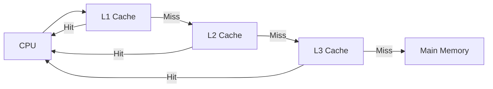
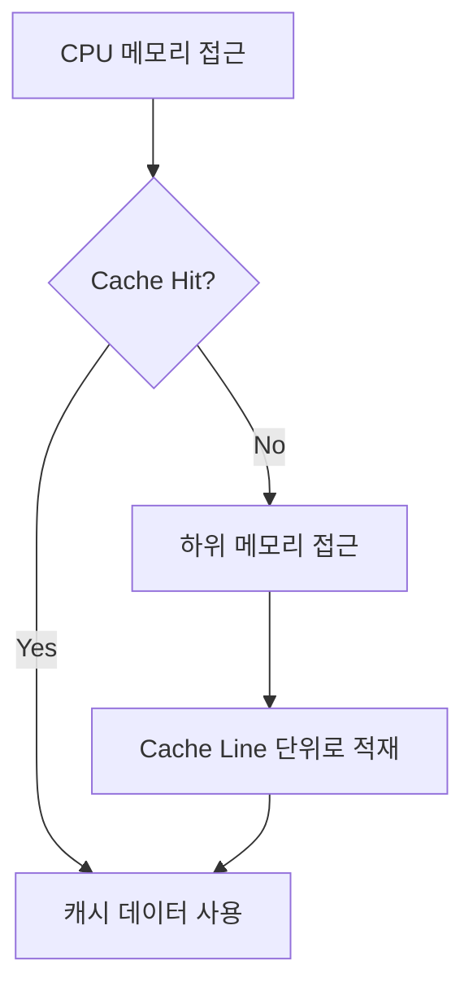
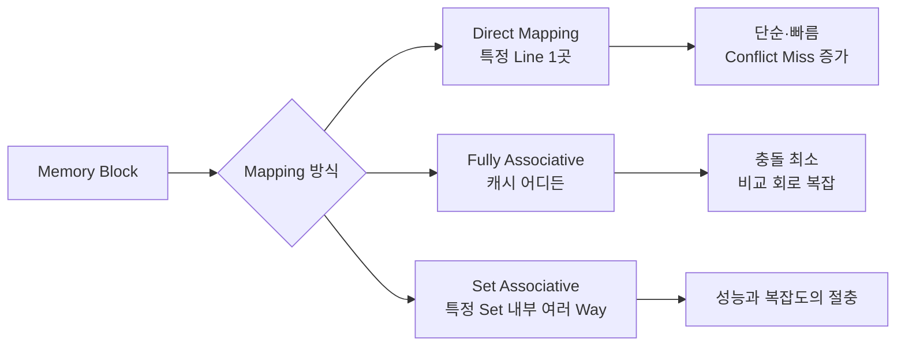
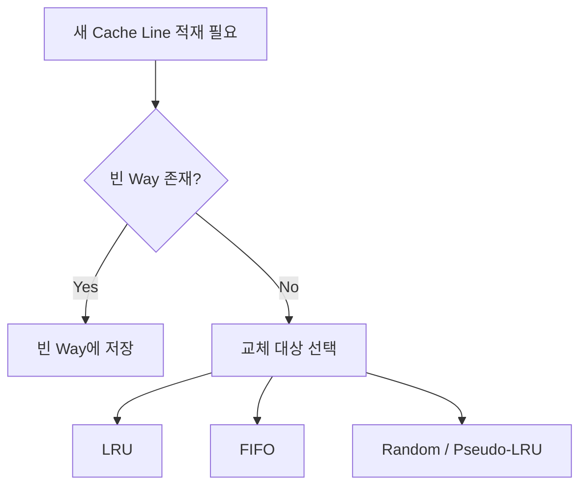
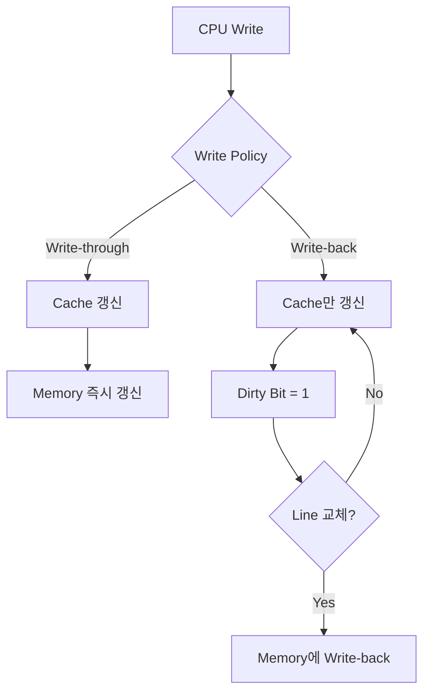
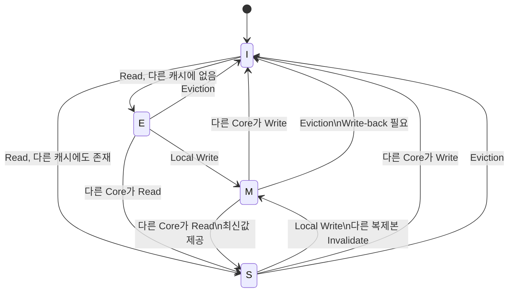
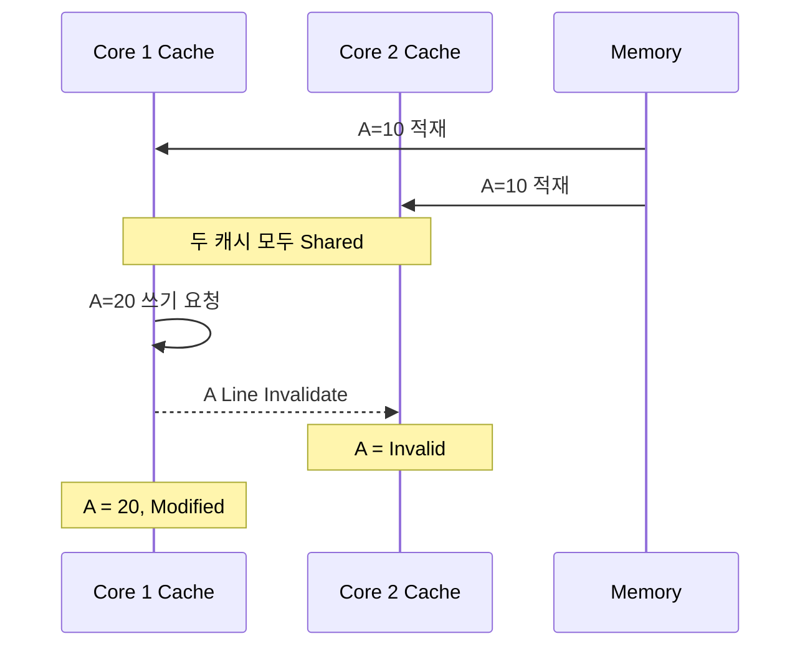
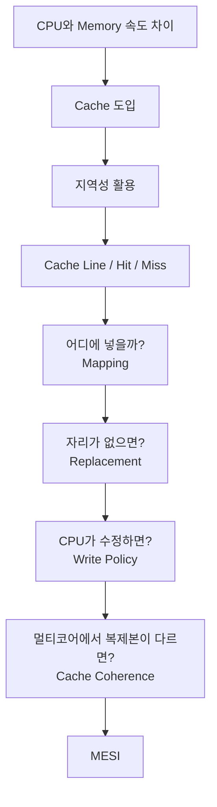

# 캐시 메모리와 쓰기·일관성

## 왜 필요한가

CPU는 매우 빠르지만 주기억장치는 상대적으로 느리다. CPU가 매번 메모리 응답을 기다리면 실행 성능이 크게 떨어진다. 캐시는 최근 또는 곧 사용할 가능성이 높은 데이터와 명령을 CPU 가까이에 보관해 이 속도 차이를 줄인다.



핵심은 CPU가 매번 RAM까지 가지 않도록, 가까운 캐시 계층에서 가능한 한 빨리 요청을 끝내는 것이다.

## 핵심 원리

캐시가 효과적인 이유는 지역성 때문이다.

- 시간 지역성: 최근 사용한 데이터는 다시 사용할 가능성이 높다.
- 공간 지역성: 사용한 주소 주변의 데이터도 곧 사용할 가능성이 높다.
- 순차 지역성: 명령은 대체로 인접한 주소 순서로 실행된다.

CPU가 주소를 요청하면 캐시의 Tag를 비교한다. 데이터가 있으면 Hit, 없으면 Miss다. Miss가 발생하면 하위 메모리에서 Cache Line 단위로 가져온다.



평균 접근시간은 Hit 시간뿐 아니라 Miss 비율과 Miss 처리 비용의 영향을 받는다. 캐시가 커져도 Hit 시간이 길어지거나 계층 관리 비용이 증가할 수 있으므로 무조건 큰 캐시가 좋은 것은 아니다.

## 캐시 매핑 방식

주기억장치의 블록을 캐시의 어느 위치에 저장할지를 결정하는 방식이다.

### Direct Mapping

각 메모리 블록이 들어갈 Cache Line이 하나로 고정된다.

```text
Cache Line = Memory Block mod Cache Line 수
```

장점은 단순하고 빠르지만, 서로 다른 블록이 같은 Line을 계속 차지하려 하면 다른 Line이 비어 있어도 Conflict Miss가 발생할 수 있다.

### Fully Associative Mapping

메모리 블록을 캐시의 어느 Line에든 저장할 수 있다. 충돌은 줄지만 요청한 블록이 어디 있는지 여러 Tag를 동시에 비교해야 하므로 하드웨어가 복잡해진다.

### Set Associative Mapping

Direct와 Fully Associative의 절충이다. 메모리 블록이 들어갈 Set은 정해지지만, 해당 Set 내부의 여러 Way 중 하나에 저장할 수 있다.



실제 CPU 캐시는 Set Associative가 일반적으로 사용된다.

## 교체 정책

Set Associative나 Fully Associative에서 후보 위치가 모두 차 있으면 어떤 Cache Line을 제거할지 결정해야 한다.

- LRU(Least Recently Used): 가장 오랫동안 사용되지 않은 Line 제거
- FIFO: 가장 먼저 들어온 Line 제거
- Random: 임의의 Line 제거

LRU는 시간 지역성을 활용한다는 점에서 직관적이지만, Way 수가 증가할수록 정확한 사용 순서를 추적하는 비용이 커져 실제 하드웨어에서는 Pseudo-LRU와 같은 근사 방식도 사용한다.



Direct Mapping은 들어갈 위치가 하나뿐이므로 별도의 교체 후보 선택이 필요하지 않는다.

## 쓰기 정책

### Write-through

캐시와 하위 메모리에 동시에 기록한다.

- 장점: 하위 메모리가 항상 최신 상태에 가깝고 일관성 관리가 단순하다.
- 단점: 쓰기 트래픽과 지연이 증가한다.
- 보완: Write Buffer로 CPU의 대기를 줄인다.

### Write-back

먼저 캐시에만 기록하고 변경된 Line을 교체할 때 하위 메모리에 반영한다.

- 장점: 반복 쓰기를 합쳐 메모리 트래픽을 줄인다.
- 단점: Dirty Line 관리가 필요하고 장애 시 최신 데이터가 캐시에만 남을 수 있다.



Write-back에서는 Dirty Bit가 "이 Line의 값이 하위 메모리와 다르다"는 것을 표시한다. Dirty Line을 교체할 때는 먼저 하위 메모리에 변경 내용을 기록해야 한다.

### Write-allocate와 No-write-allocate

Write Miss가 발생했을 때 Line을 캐시로 가져올지 결정한다.

- Write-allocate: 가져온 뒤 캐시에 기록한다. Write-back과 자주 조합된다.
- No-write-allocate: 캐시에 넣지 않고 하위 메모리에 직접 기록한다. Write-through와 자주 조합된다.

## 멀티코어 일관성

여러 코어의 캐시에 같은 메모리 값이 복제되면 한 코어의 변경을 다른 코어가 모를 수 있다.

```text
RAM       : A = 10
Core 1    : A = 20
Core 2    : A = 10
```

이 상태에서 Core 2가 자신의 캐시만 보고 A를 읽으면 오래된 값을 사용할 수 있다. Cache Coherence는 동일 주소의 복제본이 모순되지 않도록 조정한다.

### MESI Protocol

MESI는 Cache Line을 네 가지 상태로 관리한다.

- M(Modified): 내가 가진 값이 최신이고 하위 메모리와 다르다.
- E(Exclusive): 하위 메모리와 값이 같고 이 Line을 가진 캐시는 나뿐이다.
- S(Shared): 다른 캐시에도 같은 값의 복제본이 존재한다.
- I(Invalid): 더 이상 유효하지 않아 사용할 수 없는 Line이다.



예를 들어 두 코어가 같은 Line을 Shared 상태로 가지고 있을 때 한 코어가 값을 변경하려면 다른 코어의 복제본을 Invalid로 만들고 자신이 쓰기 권한을 얻는다.



이렇게 다른 캐시에 남아 있는 오래된 복제본을 사용하지 못하게 만들어 일관성을 유지한다.

일관성은 서로 다른 코어가 같은 주소를 어떻게 보느냐의 문제다. Memory Consistency는 여러 메모리 연산의 순서가 다른 코어에 어떻게 관찰되는지를 다룬다. 두 개념은 관련 있지만 동일하지 않다.

## 연결해서 기억할 흐름



즉 다음 질문 순서로 기억하면 된다.

1. 왜 캐시가 필요한가? → CPU와 메모리의 속도 차이
2. 왜 작은 캐시가 효과적인가? → 지역성
3. 어디에 저장하는가? → Mapping
4. 자리가 없으면 누구를 버리는가? → Replacement
5. 수정된 값을 언제 메모리에 반영하는가? → Write Policy
6. 여러 코어의 값이 달라지면 어떻게 하는가? → Cache Coherence / MESI

## 기술사 답안 포인트

캐시는 성능 장치이지만 용량·계층 증가가 지연과 복잡도를 만든다. 답안에서는 지역성, Mapping·교체·쓰기 정책, Hit/Miss 지표, 멀티코어 일관성을 하나의 흐름으로 연결한다.

특히 단순 용어 나열보다 다음 Trade-off를 보여주는 것이 좋다.

- Direct Mapping: 빠르고 단순하지만 Conflict Miss 증가
- Associativity 증가: Conflict Miss 감소, 비교 회로 복잡도 증가
- Write-through: 일관성 관리 용이, 메모리 트래픽 증가
- Write-back: 성능 향상, Dirty Line 및 일관성 관리 복잡도 증가
- 멀티코어 Cache: 접근 성능 향상, Cache Coherence 문제 발생
