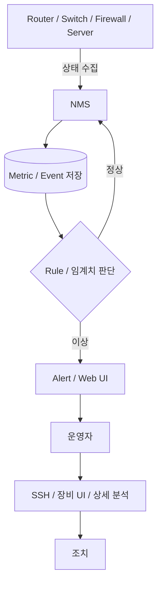
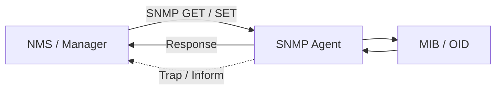
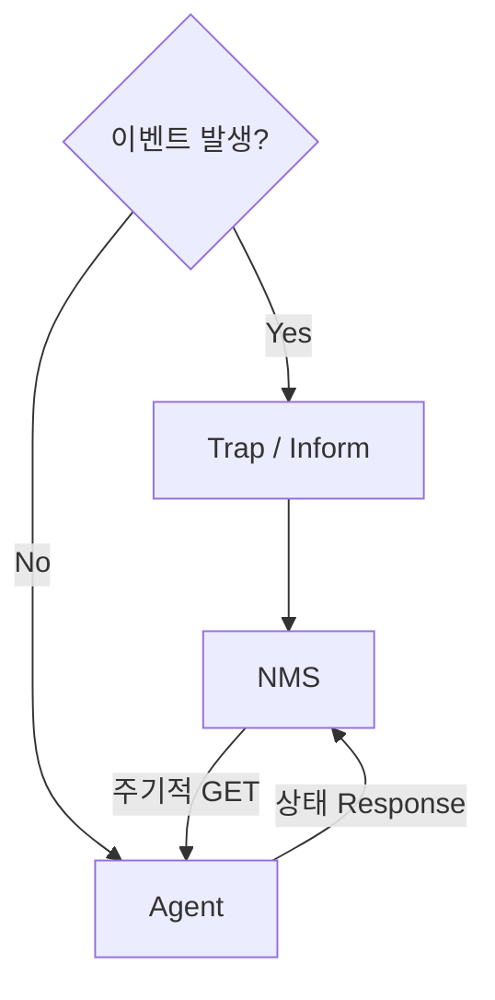
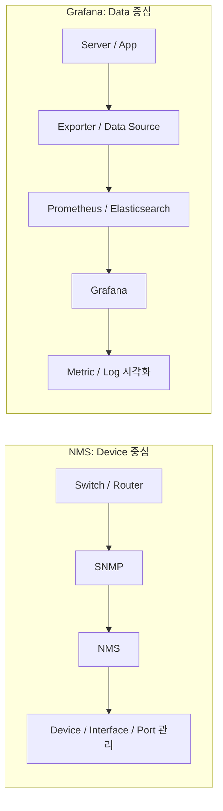

# NMS와 SNMP

## 이 문서에서 되짚을 질문

- 사람은 NMS 전체 흐름의 어디에 개입하는가?
- Agent가 상태를 먼저 보내는 편이 효율적인데 왜 Manager가 계속 묻는가?
- NMS는 Web Server이고 장비 Agent가 접속하는 구조인가?
- Polling과 Trap 중 하나만 사용하면 안 되는가?
- Grafana도 CPU·Memory·Network를 보여주는데 왜 NMS가 필요한가?
- 공유기 관리 화면도 NMS라고 할 수 있는가?

## NMS를 먼저 '사람이 쓰는 방식'으로 이해하기

NMS(Network Management System)는 여러 네트워크 장비의 상태·성능·장애·구성을 중앙에서 통합 관리하는 시스템이다. 단순히 OS 내부에서 CPU·Memory를 보는 Process가 아니다.

운영자는 보통 SNMP 명령을 직접 입력하지 않는다. NMS의 Web UI나 Console에서 상태와 Alarm을 보고, 이상이 있으면 해당 장비나 Server에 접속해 상세 원인을 분석한다.

```text
Router / Switch / Firewall / Server
              ↓
        자동 상태 수집
              ↓
             NMS
              ↓
     저장 / 임계치 판단 / Alert
              ↓
         Web UI / 알림
              ↓
            운영자
              ↓
       SSH·장비 UI 등으로
       상세 분석 및 조치
```

### Mermaid로 보는 운영자 개입 지점



예를 들어 NMS가 Memory 90% 초과를 감지하면 운영자는 NMS 그래프에서 추세를 확인하고, 필요하면 Server에 SSH 접속해 `top`, `free`, `jcmd` 같은 도구로 원인을 더 깊게 본다. 즉 **NMS는 자동 관제하고, 사람은 판단과 조치에 개입한다.**

## 기본 구조

SNMP(Simple Network Management Protocol)는 NMS Manager와 장비의 Agent가 관리 정보를 주고받는 대표 프로토콜이다.

- Manager: 조회·설정·수집·경보 처리를 담당
- Agent: 장비 내부 상태를 MIB 형태로 제공
- MIB: 관리 객체의 이름·형식·계층을 정의한 정보 구조
- OID: MIB 객체를 식별하는 계층형 번호

```text
NMS (Manager)
      │
      │ SNMP GET / SET
      ▼
    Agent
      │
      ▼
   MIB / OID
```



Web 서비스에 비유하면 Manager가 상태를 조회하는 Client 역할에 가깝고, 장비의 Agent가 요청에 응답하는 Server 역할에 가깝다. 다만 NMS는 단순 화면이 아니라 수집 일정, 지표 저장, 임계치 판단, 경보와 보고까지 담당하는 관리 시스템이다.

SNMP는 NMS가 장비에 SSH 접속해서 `show cpu` 같은 CLI 명령을 실행하는 방식이 아니다. Manager가 OID로 관리 객체를 요청하면 Agent가 해당 값을 반환한다.

> **CLI = 사람이 장비 명령을 실행하는 인터페이스**  
> **SNMP = 프로그램끼리 관리 객체를 조회·제어하는 Protocol**

## Polling과 Trap

### Polling

Manager가 일정 주기로 Agent에 값을 요청한다.

```text
NMS                    Agent
 | ---- GET CPU --------> |
 | <--- CPU = 35% --------|
 |                        |
 | ---- GET Memory -----> |
 | <--- Memory = 70% -----|
```

장점:
- 중앙에서 수집 주기와 대상을 통제한다.
- 장비별 상태를 같은 기준으로 비교하기 쉽다.
- Agent가 임의로 많은 정보를 보내는 것을 제한한다.
- 응답 없음 자체를 장애 신호로 사용할 수 있다.

한계:
- 장비와 항목이 많으면 요청 Traffic과 NMS 부하가 커진다.
- Polling 사이에 발생하고 사라진 짧은 장애를 놓칠 수 있다.

### Trap·Inform

Agent가 장애나 임계치 초과 같은 Event를 Manager에 알린다.

- Trap: 응답 확인 없이 전송하므로 빠르지만 유실될 수 있다.
- Inform: 수신 확인을 받아 신뢰성을 높이지만 부담이 증가한다.

```text
Agent
  ↓
"Port Down!"
  ↓ Trap / Inform
NMS
```

### Polling과 Trap을 같이 쓰는 이유



> **정상 상태와 추세 = Polling(Pull)**  
> **즉시 알려야 할 Event = Trap·Inform(Push)**

## 왜 Agent가 항상 먼저 보내지 않는가

Agent Push만 사용하면 많은 장비가 동시에 전송해 NMS가 폭주할 수 있고, 장비마다 전송 주기와 기준이 달라 일관된 수집이 어렵다. 또한 Agent 장애나 Network 단절 시 아무 메시지가 오지 않는 상태와 정상 상태를 구분하기 어렵다.

Manager Polling은 응답 없음 자체를 장애 신호로 사용할 수 있고 중앙 정책에 따라 수집 대상과 주기를 바꾸기 쉽다.

예를 들어 1,000대 장비에서 CPU는 5초, Interface는 30초, 온도는 10분마다 보고 싶다면 NMS가 중앙에서 Schedule을 통제하는 편이 관리하기 쉽다. Agent마다 Push 주기를 따로 관리할 필요도 줄어든다.

Push가 나쁜 방식이라는 뜻은 아니다. 최근 Streaming Telemetry처럼 장비가 지속적으로 측정값을 보내는 방식도 사용한다. 중요한 것은 Push와 Pull의 우열이 아니라 장비 수, 수집 주기, 유실 허용 여부와 중앙 통제 필요성을 보고 선택하는 것이다.

Prometheus도 Exporter가 Metric을 계속 밀어 넣는 방식보다 Prometheus가 `/metrics`를 주기적으로 Scrape하는 Pull 방식을 기본으로 사용한다는 점에서 비슷한 철학을 볼 수 있다.

## 공유기 관리자 페이지도 NMS인가

공유기 관리 화면도 WAN/LAN, DHCP, NAT, Wi-Fi 상태를 보여주므로 관리 시스템처럼 보인다. 하지만 보통은 **장비 한 대를 관리하는 Device Management UI**에 가깝다.

```text
공유기 관리자 화면
→ 장비 1대의 상태·설정 관리

NMS
→ 수십~수천 대의 장비를 중앙 통합 관리
```

반면 여러 Router·Switch·AP를 중앙 Controller에서 관리하는 제품은 NMS에 가까운 성격을 가진다.

## Grafana도 다 보여주는데 NMS가 왜 필요한가

이 질문이 NMS의 성격을 이해하는 핵심이다.

Grafana도 CPU, Memory, Disk, Network Traffic, Log 등을 훌륭하게 보여준다. 하지만 둘의 **출발점이 다르다.**

### Grafana의 출발점: 데이터 중심

> "수집된 관측 데이터를 어떻게 잘 보여줄까?"

```text
Server
  ↓
Node Exporter
  ↓
Prometheus
  ↓
Grafana
```

또는

```text
Application Log
      ↓
Elasticsearch
      ↓
Grafana / Kibana
```

Grafana는 다양한 Data Source를 조회해 Metric·Log 등을 유연하게 시각화하는 데 강하다.

### NMS의 출발점: 장비 중심

> "이 네트워크 장비들을 어떻게 중앙에서 관리할까?"

```text
Switch-01
├─ Port 1 : Up
├─ Port 2 : Down
├─ Port 3 : Traffic 800 Mbps
└─ CPU    : 40%
```

NMS는 단순히 `network_bytes`라는 Metric을 보는 것보다 **어느 장비의 어느 Interface·Port인가**라는 관리 객체 관점이 강하다.

### Mermaid로 보는 NMS와 Grafana의 출발점 차이



## NMS와 Grafana 비교

| 구분 | NMS | Grafana |
|---|---|---|
| 핵심 목적 | Network·Infra 장비 관리 | 관측 데이터 시각화 |
| 중심 관점 | Device 중심 | Data 중심 |
| 대표 대상 | Router, Switch, Firewall, AP | Server, App, DB, Container, Log 등 |
| 데이터 수집 | SNMP Polling·Trap 등 직접 수행 가능 | 보통 Data Source에서 조회 |
| 구조 인식 | Device·Interface·Port 중심 | Metric·Log·Trace 중심 |
| 제어 | 제품에 따라 설정·제어 기능 제공 | 기본적으로 관측·시각화 중심 |
| 강점 | 대규모 Network 장비 통합관리 | 다양한 데이터의 유연한 Dashboard |

> **Grafana = 수집된 관측 데이터를 잘 보여주는 도구**  
> **NMS = Network 장비 자체를 관리 대상으로 다루는 시스템**

둘은 반드시 경쟁 관계가 아니다. Network 장비는 NMS로 관리하고, Server·Application Metric은 Prometheus/Grafana로 관측하는 식으로 함께 사용할 수 있다.

## NMS만의 강점

### 장비·Interface·Port 중심 관리

NMS는 단순한 그래프보다 다음 질문에 강하다.

- 어느 Switch인가?
- 어느 Interface인가?
- 해당 Port는 Up/Down인가?
- 어떤 장비와 연결되어 있는가?
- 장애가 어느 구간에 영향을 주는가?

### 오래된 Network 관리 생태계

Router, Switch, Firewall, UPS, Printer 등 다양한 Infra 장비가 SNMP를 오랫동안 지원해 왔다. Vendor가 달라도 표준화된 관리 객체를 통해 상태를 수집할 수 있다는 장점이 있다.

### 장애 관제

Interface Down, Link 장애, 장비 응답 없음, Traffic 이상, CPU·Memory 임계치 등을 **장비 단위로 빠르게 식별**하는 데 적합하다.

### 관리·제어

제품에 따라 SNMP SET, Configuration Backup, 설정 변경·이력 관리 등 단순 관측을 넘어선 기능도 제공한다.

### Topology 관점

일부 NMS는 장비 간 연결 관계를 보여주어 어디가 끊어졌고 영향 범위가 어디까지인지 파악하는 데 강하다.

> **NMS의 강점은 예쁜 그래프가 아니라 Network 장비를 '관리 객체'로 이해한다는 데 있다.**

## Cloud에서는 NMS가 필요 없나

Cloud에서는 물리 Router·Switch를 CSP가 관리하므로 사용자가 그 장비에 직접 SNMP를 보내지 못하는 경우가 많다. 사용자는 VPC/VNet, Route Table, Security Group, Load Balancer, Cloud Monitoring 같은 추상화된 자원을 관리한다.

따라서 전통 NMS 역할의 일부가 CSP 관리 Platform으로 이동한다. 하지만 Hybrid Cloud, On-Premise, 지사망, Firewall, AP처럼 사용자가 직접 관리하는 장비가 있다면 NMS의 역할은 여전히 중요하다.

## Observability와의 관계

현대 운영 대상은 Network를 넘어 Server, WAS, DB, Container, Kubernetes, Application까지 넓어졌다.

```text
Network Device → SNMP → NMS
Server Metric  → Exporter → Prometheus → Grafana
JVM            → JMX / Exporter
Log            → Elasticsearch → Kibana/Grafana
Application    → APM / Trace
```

전통 NMS가 사라졌다기보다 **NMS가 담당하던 Network 관제 위로 Observability 영역이 넓게 확장되었다**고 이해하면 좋다.

## SNMP 운영 고려사항

- 수집 주기와 장비 수에 따른 부하
- Counter의 누적값·단위·Wraparound 해석
- 임계치와 오탐·미탐
- 시간 동기화
- 접근권한과 암호화
- SNMPv3의 인증·무결성·기밀성
- 장애 시 Polling·Trap·Log·Telemetry의 상호 검증

## 기억 흐름

```text
여러 장비를 사람이 하나씩 확인하기 어렵다
→ NMS

장비와 표준적으로 정보를 주고받고 싶다
→ SNMP

정기 상태는 중앙에서 통제해 수집
→ Polling

장애는 즉시 알고 싶다
→ Trap·Inform

Grafana도 그래프를 보여준다
→ 하지만 Grafana는 Data 시각화 중심

장비·Port·Interface 자체를 관리해야 한다
→ NMS의 강점
```
