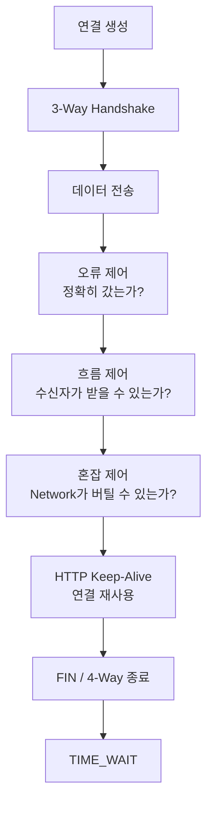
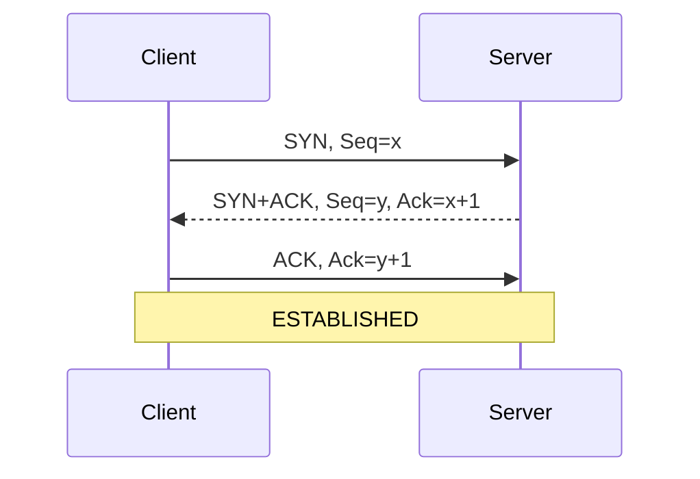
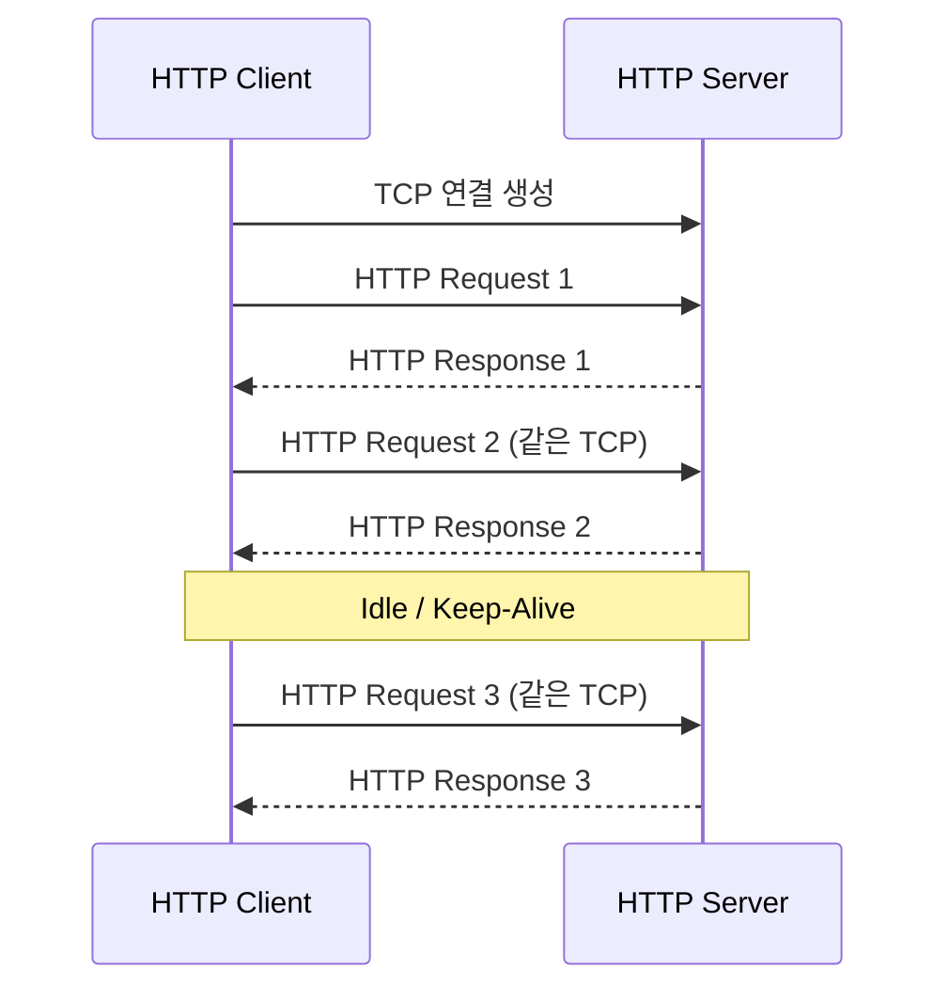
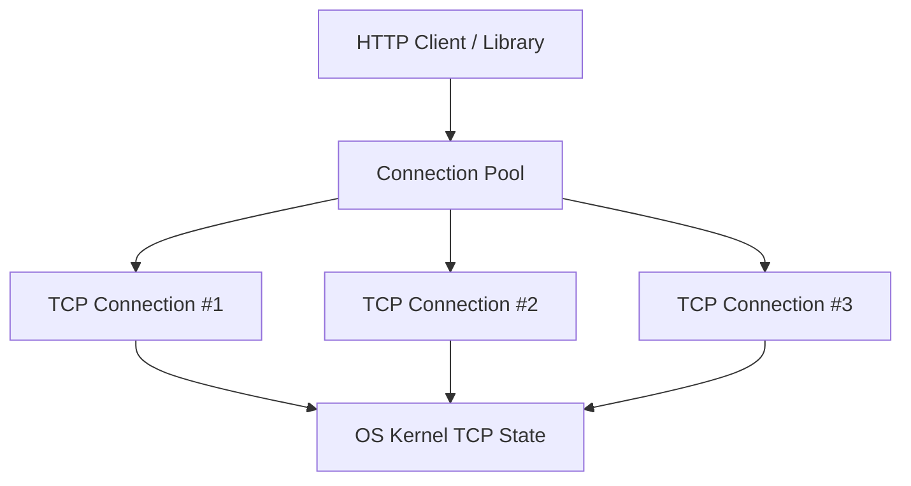
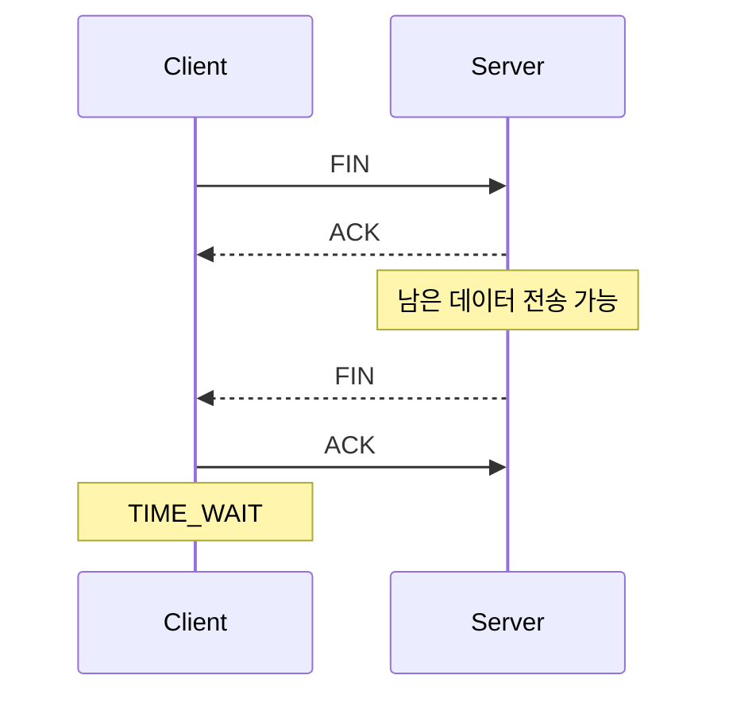
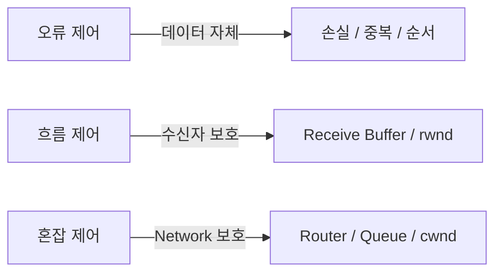
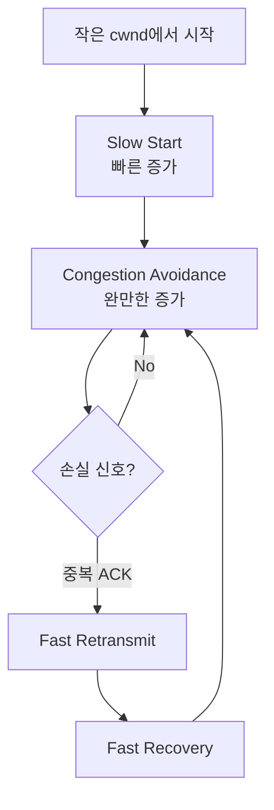

# TCP 연결·종료·흐름·혼잡 제어

## 이 문서의 목적

TCP 용어를 따로 외우기보다 다음 질문을 하나의 흐름으로 이해한다.

- TCP 연결은 실제로 무엇이며 어디에 기록되는가?
- HTTP Keep-Alive와 TCP Keepalive, Connection Pool은 무엇이 다른가?
- 연결할 때는 3단계인데 종료할 때는 왜 보통 4단계인가?
- 오류 제어·흐름 제어·혼잡 제어는 각각 무엇을 보호하는가?
- **왜 오류 제어 → 흐름 제어 → 혼잡 제어 순으로 보면 이해하기 쉬운가?**

## 왜 이 순서로 학습하는가

TCP는 기능을 따로 외우기보다 **문제의 범위가 점점 바깥으로 확장되는 순서**로 보면 이해하기 쉽다.

```text
① 연결을 만든다
   3-Way Handshake
        ↓
② 연결을 끝낸다
   FIN / 4-Way Handshake
        ↓
③ 데이터가 제대로 갔는가?
   오류 제어
        ↓
④ 수신자가 감당할 수 있는가?
   흐름 제어
        ↓
⑤ 중간 Network가 감당할 수 있는가?
   혼잡 제어
        ↓
⑥ 이 TCP 연결을 HTTP가 어떻게 재사용하는가?
   Keep-Alive / Connection Pool
```



오류 제어에서는 가장 먼저 **전달 자체의 정확성**을 해결한다. 그다음 데이터는 잘 가지만 상대가 느린 경우를 흐름 제어로 해결하고, 마지막으로 송수신자는 괜찮지만 중간 Network가 버티지 못하는 경우를 혼잡 제어로 해결한다.

> **연결을 만들고 → 데이터를 확실히 보내고 → 상대방 속도에 맞추고 → Network 속도에도 맞춘다.**

이 흐름을 잡으면 ACK, Sliding Window, `rwnd`, `cwnd`, Slow Start가 서로 떨어진 암기 항목이 아니라 하나의 문제 해결 과정으로 연결된다.

## 1. TCP는 왜 필요한가

IP는 Packet을 목적지까지 전달하려고 노력하지만 도착, 순서, 중복 제거를 보장하지 않는다. TCP는 이를 보완해 애플리케이션에 **신뢰할 수 있는 Byte 흐름**을 제공한다.

- Sequence Number: 데이터 위치와 순서
- Acknowledgment Number: 다음에 받을 것으로 기대하는 번호
- Checksum: 오류 검출
- Timer·재전송: 손실 대응
- Window: 한 번에 보낼 양 조절

## 2. TCP 연결은 물리적인 통로인가

TCP 연결은 전용 선이 생기거나 회선을 계속 점유하는 것이 아니다. 양쪽 운영체제가 통신 상태를 Memory에 기록하고 같은 규칙에 따라 관리하는 **논리적 상태**다.

연결은 보통 4-Tuple로 구분한다.

```text
출발지 IP + 출발지 Port + 목적지 IP + 목적지 Port
```

Kernel은 각 연결에 다음 정보를 보관한다.

- LISTEN, ESTABLISHED, FIN_WAIT, TIME_WAIT 등의 상태
- 송신·수신 순서번호
- 아직 ACK 받지 못한 데이터
- 송신·수신 Buffer
- 수신 Window와 혼잡 Window
- 재전송·Keepalive Timer

따라서 “연결이 유지된다”는 말은 선이 계속 열려 있다는 뜻이 아니라 **양쪽 OS가 연결 상태를 지우지 않고 다음 데이터를 받을 준비를 하고 있다**는 뜻이다.

## 3. 연결 설정: 3-Way Handshake



1. Client가 SYN으로 자기 초기 순서번호를 알린다.
2. Server가 SYN+ACK로 자기 순서번호와 Client SYN 수신을 알린다.
3. Client가 ACK로 Server의 SYN 수신을 확인한다.

### 왜 두 단계가 아니라 세 단계인가

Server의 응답까지만 있으면 Client의 요청이 Server에 도착했다는 것은 알 수 있다. 하지만 Server의 응답이 Client에게 정상 도착했는지는 Server가 알 수 없다. 마지막 ACK가 있어야 양쪽 모두 양방향 통신 가능 여부와 초기 순서번호를 확인한다.

> 3-Way Handshake는 단순 인사가 아니라 **양방향 통신 능력과 초기 상태를 합의하는 과정**이다.

## 4. HTTP 연결을 재사용한다는 의미

HTTP 요청 하나가 끝날 때마다 TCP를 닫으면 다음 요청마다 다시 3-Way Handshake가 필요하다. HTTPS라면 TLS 연결 비용도 추가될 수 있다.

HTTP Keep-Alive는 하나의 TCP 연결을 바로 닫지 않고 여러 HTTP 요청과 응답에 재사용한다.



### HTTP/1.0과 HTTP/1.1

- HTTP/1.0: 요청·응답 후 연결 종료가 기본이며 재사용하려면 Keep-Alive를 명시하는 방식이 사용됨
- HTTP/1.1: 지속 연결이 기본이며 일반적으로 `Connection: close`로 종료 의사를 표시

### timeout과 max

- `timeout`: 요청이 없는 연결을 얼마나 기다린 뒤 닫을 것인가
- `max`: 한 연결에서 최대 몇 개의 요청을 처리할 것인가

너무 오래 유지하면 유휴 Socket과 Memory가 Server 자원을 차지한다. 너무 빨리 닫으면 연결 재사용 효과가 줄어든다.

이 값들은 **보장값이라기보다 정책값**으로 이해하는 것이 좋다. Client, Server, Proxy, Load Balancer, Network 상태에 따라 더 일찍 종료될 수 있다.

## 5. HTTP Keep-Alive·TCP Keepalive·Connection Pool

| 개념 | 관리 위치 | 목적 |
|---|---|---|
| HTTP Keep-Alive | HTTP 계층 | 여러 HTTP 요청이 하나의 TCP 연결을 재사용 |
| TCP Keepalive | OS TCP 계층 | 오랫동안 데이터가 없는 연결의 상대가 살아 있는지 확인 |
| Connection Pool | 애플리케이션·Library | 여러 연결을 보관하고 빌려주며 재사용 |

HTTP Keep-Alive는 한 번 건 전화로 여러 용건을 이어서 말하는 것과 비슷하다. TCP Keepalive는 한동안 말이 없을 때 상대가 여전히 전화를 받고 있는지 확인하는 신호다. Connection Pool은 사용할 수 있는 전화 연결 여러 개를 보관했다가 필요한 작업에 빌려주는 관리 장치다.

### “TCP 연결을 Memory에 기록하면 Connection Pool 아닌가?”

둘은 관련 있지만 같지 않다. Kernel은 TCP가 동작하기 위해 모든 연결 상태를 관리한다. Connection Pool은 그 위에서 애플리케이션이 여러 연결의 생성·대여·반납·폐기 정책을 관리한다.



> **Kernel의 TCP 상태 = 연결 자체**  
> **Connection Pool = 여러 연결을 재사용하는 상위 관리 방식**

## 6. 연결 종료: 왜 보통 4-Way인가

TCP는 양방향 통신이다. 한쪽이 보낼 데이터를 모두 보냈더라도 상대는 아직 보낼 데이터가 남아 있을 수 있으므로 두 방향을 따로 닫는다.



1. 한쪽이 FIN으로 더 보낼 데이터가 없다고 알린다.
2. 상대가 ACK로 FIN 수신을 확인한다.
3. 상대도 전송을 마치면 FIN을 보낸다.
4. 처음 FIN을 보낸 쪽이 마지막 ACK를 보낸다.

연결 설정에서는 Server가 SYN과 ACK를 함께 보낼 수 있지만 종료에서는 첫 FIN을 받은 시점에 상대가 아직 전송 중일 수 있으므로 ACK와 자기 FIN 사이에 시간이 생긴다.

상대에게 남은 데이터가 없다면 ACK와 FIN이 함께 전달될 수도 있다. 실제 Segment 수는 줄 수 있지만 개념적으로는 **두 방향의 종료를 각각 확인한다.**

또한 연결을 먼저 시작한 쪽만 FIN을 보낼 수 있는 것은 아니다. **Client와 Server 어느 쪽이든 종료를 먼저 시작할 수 있다.**

## 7. TIME_WAIT는 왜 필요한가

먼저 종료를 시작하고 마지막 ACK를 보낸 쪽은 연결 정보를 즉시 지우지 않고 일정 시간 TIME_WAIT 상태로 기다린다.

### 마지막 ACK 유실 대응

마지막 ACK가 사라지면 상대는 FIN을 다시 보낸다. 상태가 남아 있어야 다시 ACK할 수 있다.

### 이전 연결의 지연 Segment 제거

이전 연결의 Segment가 늦게 도착할 수 있다. 같은 4-Tuple로 새 연결을 너무 빨리 만들면 이전 데이터가 새 연결에 섞일 위험이 있다.

따라서 TIME_WAIT가 많다고 곧바로 장애라고 단정하면 안 된다. 짧은 연결을 매우 많이 만들면 자연스럽게 증가할 수 있다.

## 8. 오류·흐름·혼잡 제어

| 구분 | 해결하려는 문제 | 주된 수단 |
|---|---|---|
| 오류 제어 | 손실·중복·순서 뒤바뀜 | Sequence, ACK, Checksum, Timer, 재전송 |
| 흐름 제어 | 송신자가 수신자보다 너무 빠름 | 수신 Window(`rwnd`) |
| 혼잡 제어 | Network 내부에 Packet이 과도하게 몰림 | 혼잡 Window(`cwnd`), 속도 조절 |



이 셋을 **오류 → 흐름 → 혼잡** 순으로 보면 문제 범위가 자연스럽게 넓어진다.

### 오류 제어: 제대로 도착했는가

수신자는 Sequence Number로 누락·중복·순서를 판단한다. 송신자는 ACK가 오지 않거나 중복 ACK 같은 손실 신호가 나타나면 필요한 데이터를 재전송한다.

ACK 번호는 일반적으로 **다음에 받을 것으로 기대하는 번호**다. `Ack=1001`이라면 1000번까지 받았고 다음에는 1001번부터 기다린다는 식으로 이해할 수 있다.

### 흐름 제어: 수신자가 감당할 수 있는가

수신 애플리케이션 처리보다 송신이 빠르면 Receive Buffer가 가득 찬다. 수신자는 여유를 `rwnd`로 알려 송신량을 제한한다.

Sliding Window는 매번 하나 보내고 ACK를 기다리는 대신 Window 범위에서 여러 데이터를 연속 전송하고 ACK가 오면 전송 가능 범위를 앞으로 이동시킨다.

### 혼잡 제어: 중간 Network가 감당할 수 있는가

수신자가 충분히 빨라도 Router와 Link에 Packet이 몰리면 Queue가 가득 차고 손실과 지연이 발생한다. 송신자는 혼잡 신호를 보고 `cwnd`를 조절한다.

## 9. 실제로 얼마나 보낼 수 있는가

송신자는 수신자와 Network의 한계를 모두 지켜야 한다.

```text
실제 전송 Window ≈ min(rwnd, cwnd)
```

- 수신 Buffer가 부족하면 `rwnd`가 더 작은 제한
- Network가 혼잡하면 `cwnd`가 더 작은 제한

수도관에 비유하면 `rwnd`는 목적지 물탱크가 받을 수 있는 양이고, `cwnd`는 중간 배관이 통과시킬 수 있다고 판단한 양이다.

## 10. Slow Start·Congestion Avoidance·Fast Retransmit·Fast Recovery

TCP는 연결 직후 Network가 얼마나 감당할 수 있는지 모른다. 작은 혼잡 Window에서 시작해 전송 가능량을 탐색한다.

### Slow Start

이름은 Slow지만 ACK가 정상적으로 돌아오는 동안 Window는 비교적 빠르게 증가한다. **작은 값에서 출발한다**는 의미에 가깝다.

```text
1 → 2 → 4 → 8 → 16 ...
```

### Congestion Avoidance

임계 영역 이후에는 증가 속도를 완만하게 해 Network의 한계를 조심스럽게 탐색한다.

### Fast Retransmit

중복 ACK가 반복되면 특정 Segment가 손실됐다고 추정해 Timeout 전에 재전송한다.

### Fast Recovery

손실 하나가 발생했다고 Network 전체가 완전히 막힌 것은 아닐 수 있다. 전송량을 무조건 처음 수준까지 내리지 않고 줄인 뒤 다시 회복한다.



세부 TCP Algorithm마다 수치와 동작은 다르지만 기술사 학습에서는 먼저 이 원리를 잡는다.

## 11. 전체 동작을 한 번에 연결하기

1. Client와 Server가 3-Way Handshake로 연결 상태를 만든다.
2. Kernel이 Sequence, Buffer, Window와 Timer를 관리한다.
3. HTTP 요청과 응답이 TCP Byte Stream으로 전달된다.
4. 오류 제어가 손실·중복·순서를 처리한다.
5. 흐름 제어가 수신자의 처리 한계를 넘지 않게 한다.
6. 혼잡 제어가 중간 Network에 과도한 Packet을 보내지 않게 한다.
7. HTTP Keep-Alive를 사용하면 같은 연결로 다음 요청을 처리한다.
8. HTTP Client는 Connection Pool로 재사용 가능한 여러 연결을 관리할 수 있다.
9. 더 재사용하지 않으면 FIN과 ACK로 양방향을 닫는다.
10. 마지막 ACK를 보낸 쪽은 TIME_WAIT에서 안전한 종료를 보장한다.

Handshake, Keep-Alive, Window, TIME_WAIT는 서로 무관한 암기 항목이 아니다. 모두 **신뢰할 수 있는 연결을 만들고, 효율적으로 사용하고, 안전하게 정리하는 과정**에 속한다.

## 12. 자주 헷갈리는 부분

- TCP 연결은 물리 회선이 아니라 양쪽 OS가 관리하는 상태다.
- HTTP Keep-Alive와 TCP Keepalive는 이름만 비슷하고 목적과 계층이 다르다.
- Connection Pool은 TCP 연결 자체가 아니라 여러 연결을 재사용하는 상위 관리 방식이다.
- FIN은 연결을 처음 시작한 주체만 보내는 것이 아니다.
- 4-Way 종료는 양방향 전송을 각각 닫기 때문에 필요하다.
- TIME_WAIT는 쓸모없이 남은 연결이 아니라 안전한 종료를 위한 상태다.
- 흐름 제어는 수신자를, 혼잡 제어는 중간 Network를 보호한다.
- Slow Start는 계속 느리게 증가한다는 뜻이 아니라 작은 전송량에서 시작한다는 뜻이다.

## 13. 기술사 답안에서 가져갈 핵심

```text
목적
IP의 비신뢰성을 보완해 신뢰성 있는 Byte Stream 제공

연결 관리
3-Way Handshake → 상태 유지·연결 재사용 → 4-Way 종료·TIME_WAIT

전송 제어
오류 제어(정확성)
+ 흐름 제어(수신자 보호)
+ 혼잡 제어(Network 보호)

Trade-off
Keep-Alive로 연결 비용 절감 ↔ 유휴 연결의 자원 점유
Window 확대로 처리량 향상 ↔ 수신자·Network 한계 보호
```

> TCP는 연결 상태와 Sequence·ACK·재전송으로 신뢰성을 제공하고, `rwnd`와 `cwnd`로 수신자 및 Network의 처리 한계에 맞춰 전송량을 조절한다.
