# 인공지능 세부학습 개념지도

이 문서는 `09-인공지능`의 세부 문서를 읽기 전에 **전체 개념의 위치와 관계를 Mermaid Diagram으로 먼저 잡기 위한 지도**다.

장문 설명을 대체하는 문서가 아니라, 각 상세 문서에서 배운 개념이 어디에 연결되는지 빠르게 복습하는 용도다.

---

## 1. 전체 학습 지도

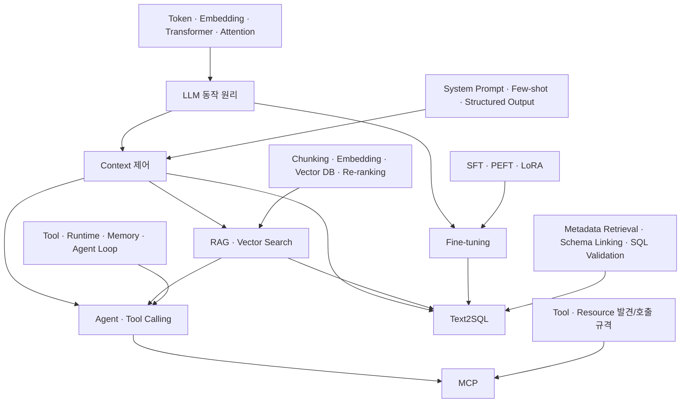

가장 중요한 큰 구분은 다음이다.

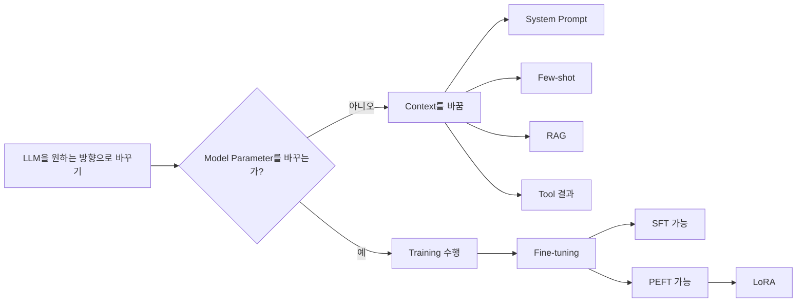

---

## 2. LLM이 답변을 한 Token씩 만드는 흐름

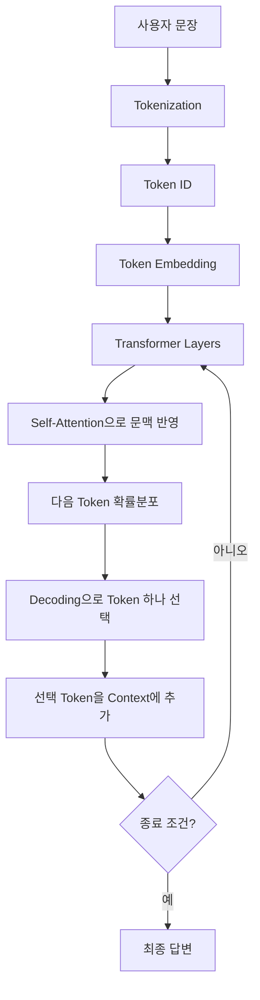

핵심은 **완성된 문장을 먼저 만드는 것이 아니라 생성된 Token을 다시 Context에 넣고 다음 Token을 반복 예측한다는 것**이다.

상세: `LLM의-동작원리.md`

---

## 3. Training과 Inference

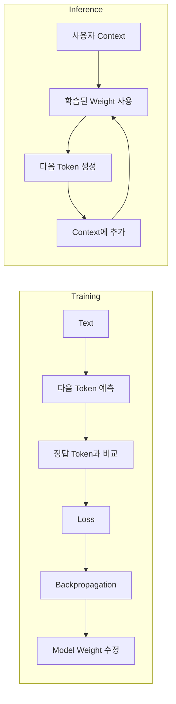

- Training: Weight를 학습한다.
- Inference: 학습된 Weight를 사용한다.

---

## 4. System Prompt · Few-shot · RAG 관계

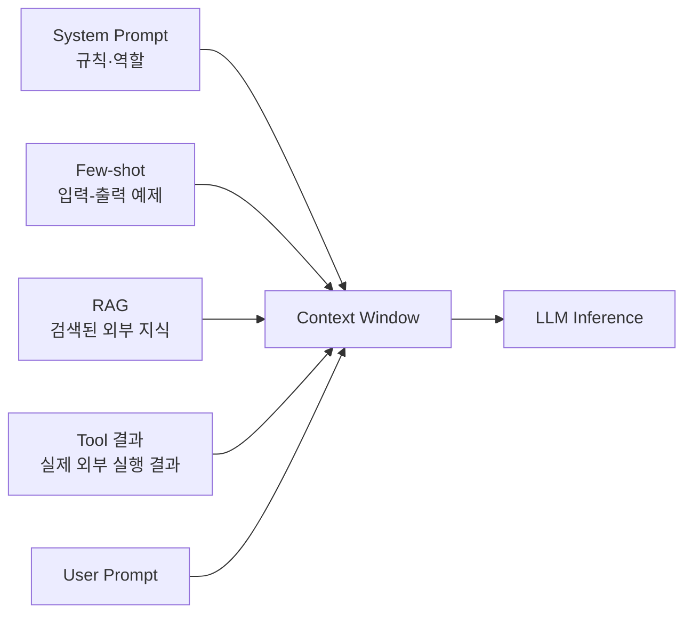

모두 LLM 입장에서는 결국 **현재 요청에 들어온 Token**이다.

차이는 무엇을 넣느냐이다.

- System Prompt: 어떻게 행동할지
- Few-shot: 어떻게 풀지 예제로 보여주기
- RAG: 무엇을 참고할지
- Tool 결과: 외부에서 실제로 확인한 결과

상세: `LLM-프롬프트와-Context-제어.md`

---

## 5. RAG 구축과 질문 처리

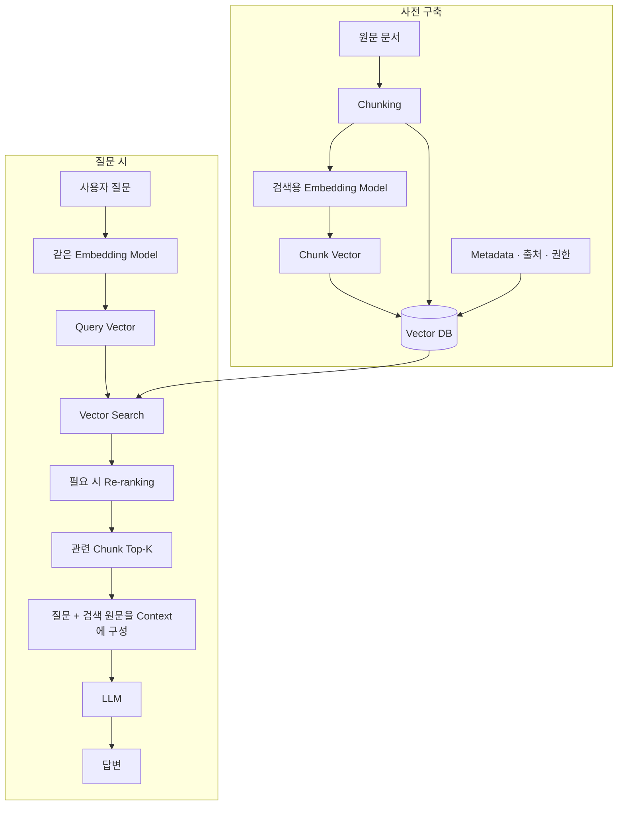

여기서 검색용 Vector는 **문서를 찾기 위한 것**이고, LLM이 실제 답변에 참고하는 것은 검색된 **원문 Text**다.

상세: `임베딩-벡터검색-RAG.md`

---

## 6. 긴 Chunk가 Vector 하나가 되는 흐름

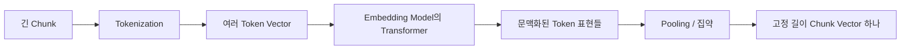

이 Vector는 원문을 복원하는 압축 파일이 아니다. **검색에 필요한 의미적 특징을 대표하는 좌표**다.

---

## 7. HNSW와 IVF

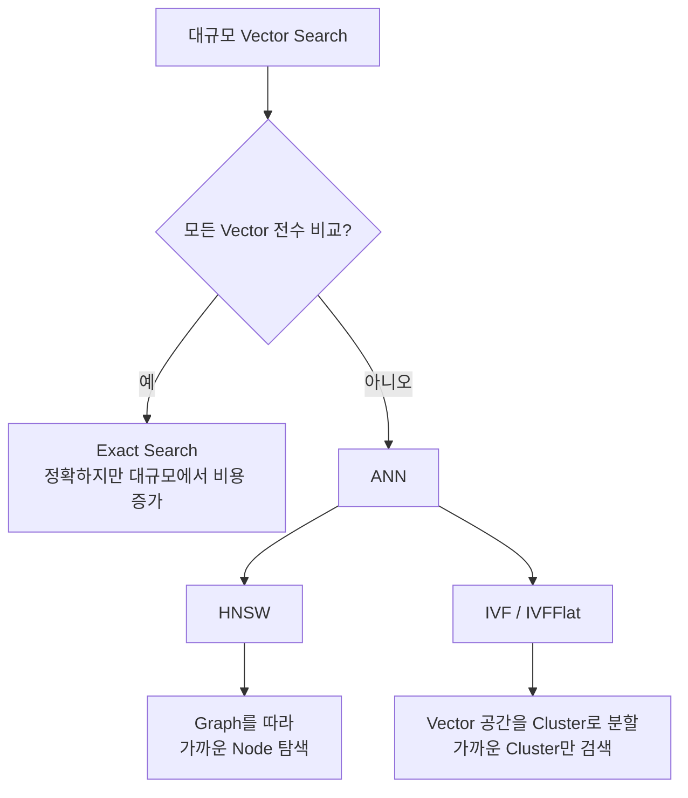

- HNSW: Graph 기반 ANN
- IVF: Cluster 기반 ANN

---

## 8. Fine-tuning 분류를 한 줄로 외우면 안 되는 이유

`Fine-tuning → SFT → PEFT → LoRA`를 일렬 계층으로 외우면 부정확하다.

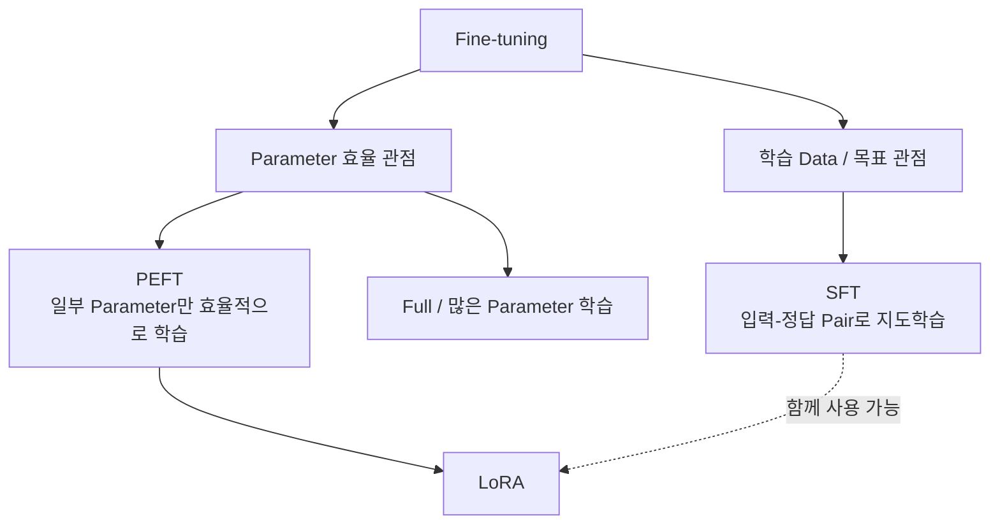

즉 **SFT는 학습 신호 관점**, **PEFT/LoRA는 Parameter를 어떻게 효율적으로 학습하느냐의 관점**이다.

상세: `Fine-tuning과-PEFT-LoRA.md`

---

## 9. RAG · Few-shot · Fine-tuning 선택 지도

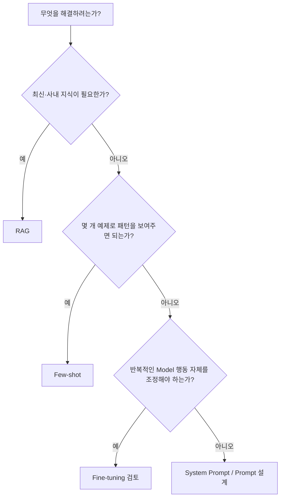

이 선택지는 배타적이지 않다. 실제 시스템에서는 RAG + Few-shot + Fine-tuning을 함께 사용할 수도 있다.

---

## 10. Agent Loop

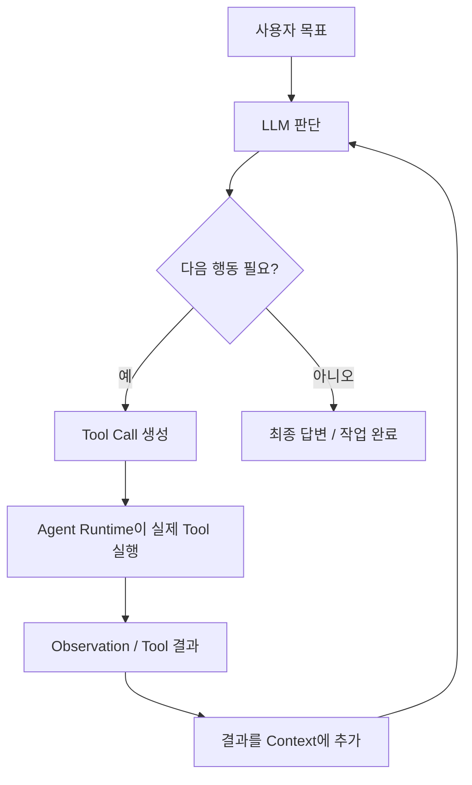

핵심 역할:

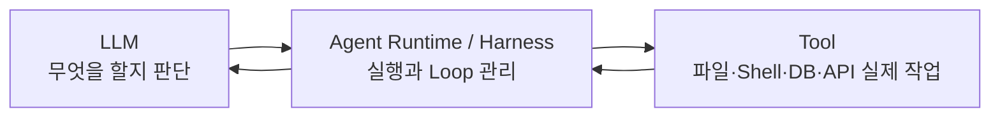

상세: `에이전트와-MCP.md`

---

## 11. MCP는 Agent와 외부 기능 사이의 '지도 + 규격'

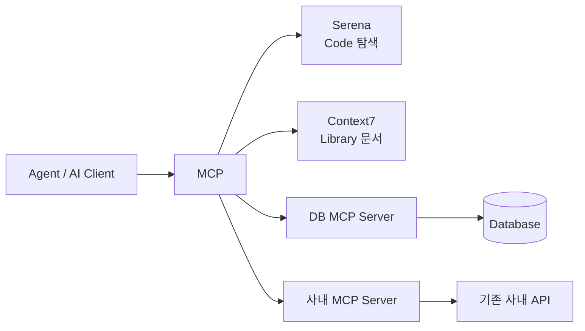

MCP가 없어도 Agent마다 전용 연동을 직접 구현할 수 있다.

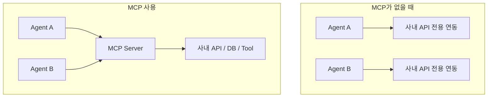

MCP는 기능 그 자체보다 **Tool·Resource를 어떻게 발견하고 호출할지 표준화**하는 역할이다.

---

## 12. RAG와 MCP는 계층이 다르다

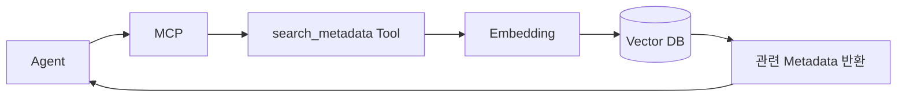

이 구조에서는:

- 바깥 Interface는 MCP
- Tool 내부 검색 방식은 RAG

따라서:

> **RAG = 관련 정보를 어떻게 찾을 것인가**
>
> **MCP = 그 기능을 Agent에게 어떻게 표준적으로 제공할 것인가**

---

## 13. Text2SQL은 LLM보다 상위의 문제 영역이다

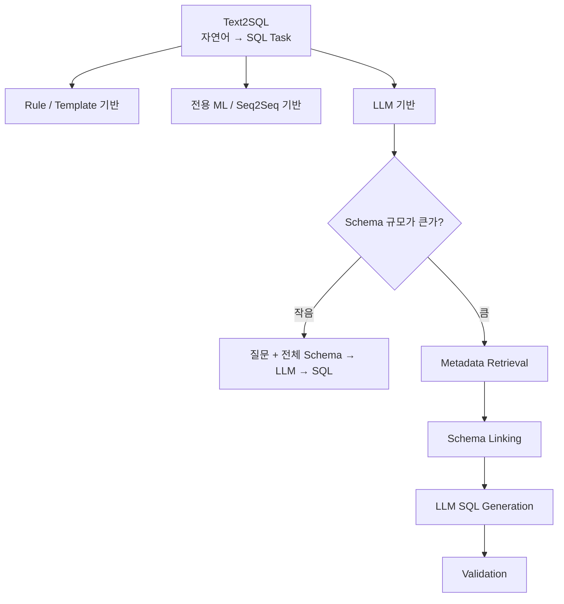

LLM은 Text2SQL을 구현하는 방법 중 하나일 뿐이다.

상세: `Text2SQL과-스키마-링킹.md`

---

## 14. LLM 기반 대규모 Text2SQL 상세 흐름

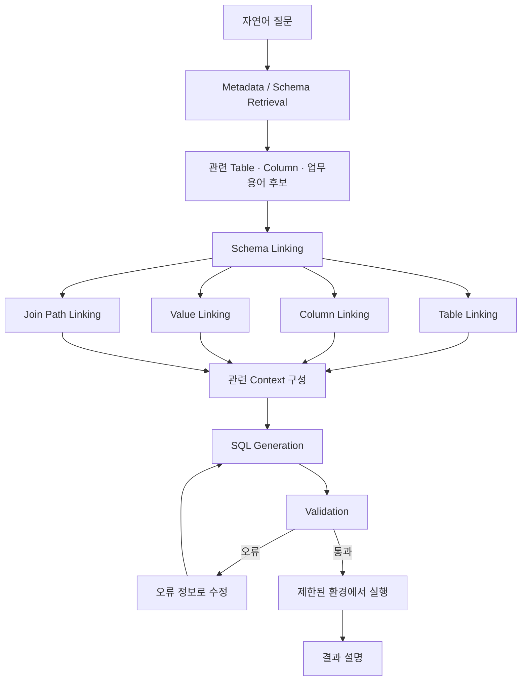

Schema Linking은 특정 Model 이름이 아니라 **질문의 개념을 실제 DB 요소와 연결하는 Task**다.

---

## 15. 전체 기억 흐름

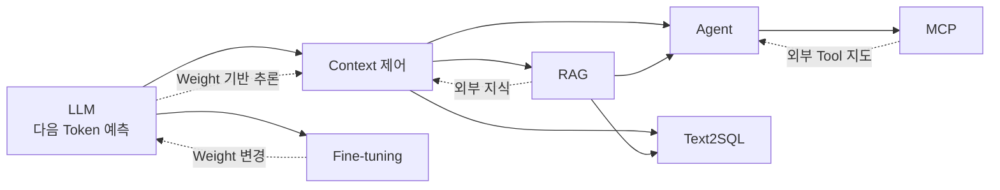

마지막으로 가장 중요한 문장만 묶으면:

> **LLM은 Context를 보고 다음 Token을 예측하는 Model이다.**
>
> **RAG는 외부 지식을 검색해서 Context에 넣는다.**
>
> **Fine-tuning은 Model Parameter를 실제로 학습한다.**
>
> **Agent는 LLM 판단을 Tool 실행과 반복 Loop로 확장한다.**
>
> **MCP는 Agent가 외부 Tool·Resource를 표준 방식으로 발견하고 호출하도록 연결한다.**
>
> **Text2SQL은 자연어를 SQL로 바꾸는 Task이며 LLM은 그 구현 방식 중 하나다.**
