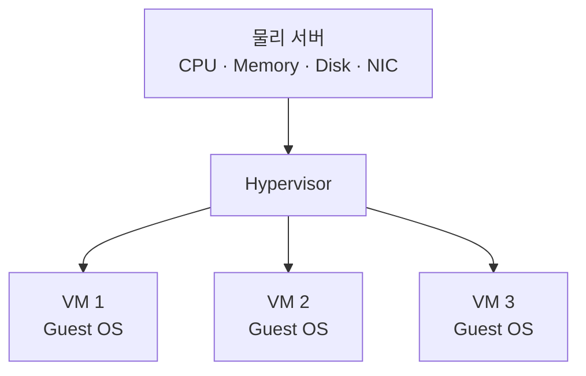
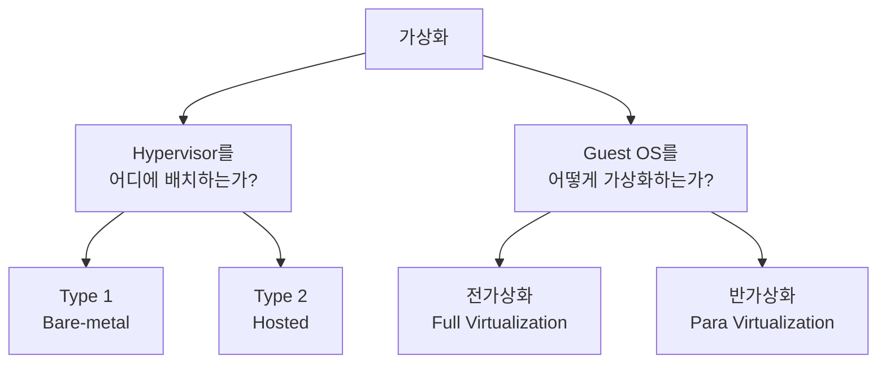
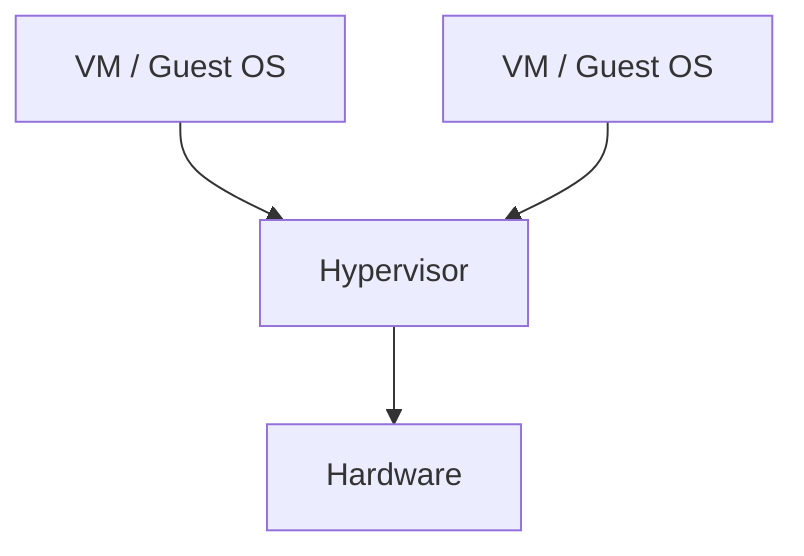
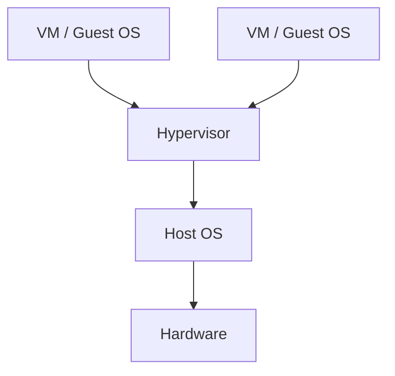
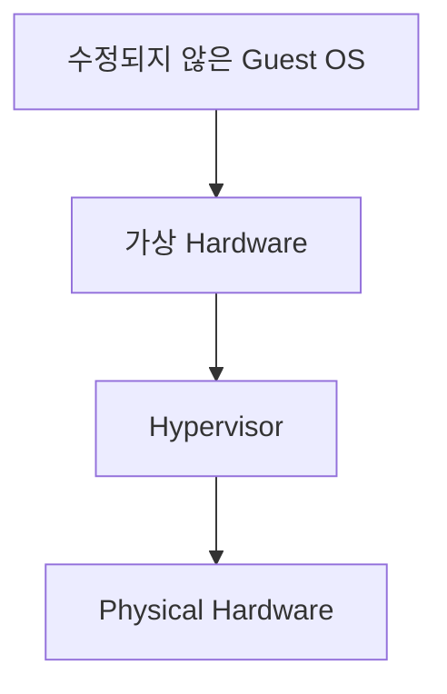
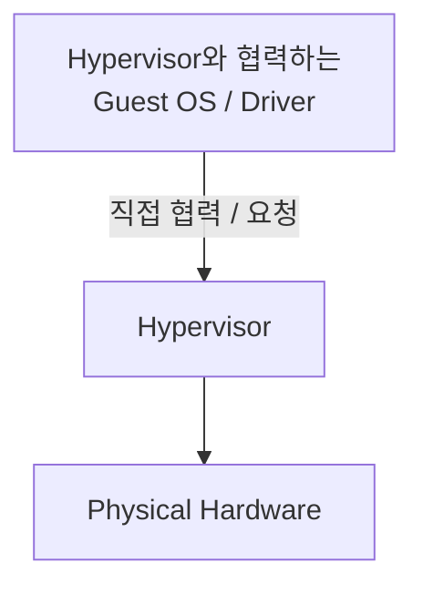
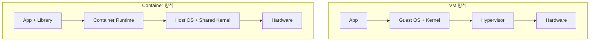
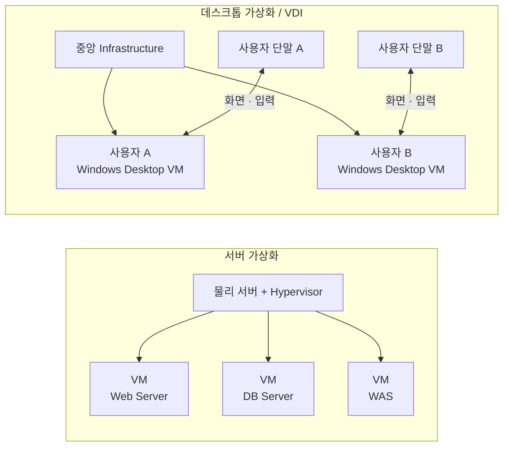

# 가상화 구조와 VM·컨테이너

## 이 문서에서 되짚을 질문

- 가상화는 실제 물리 자원을 복제하는 것인가, 나누어 쓰게 하는 것인가?
- VM마다 운영체제가 있는데 어떻게 한 물리 서버에서 동시에 실행되는가?
- Type 1/Type 2가 전가상화/반가상화와 같은 분류인가?
- 컨테이너도 격리되는데 왜 VM보다 가볍고 보안 경계는 다르게 보는가?
- 서버 가상화와 데스크톱 가상화는 둘 다 VM을 쓰는데 왜 다른 개념인가?

## 가상화의 목적

물리 자원을 그대로 사용하면 한 서버에 하나의 운영체제와 업무가 강하게 결합되고, 자원 활용률과 이동성이 낮아진다. 가상화는 CPU·메모리·스토리지·네트워크를 논리 자원으로 추상화해 여러 실행환경이 공유하도록 한다.

얻는 효과는 서버 통합, 격리, 신속한 생성, Snapshot·이동, 자원 할당 유연성이다. 대신 가상화 계층의 Overhead, Host 장애 영향 확대, 자원 경합, 운영 복잡성이 생긴다.

가상화가 CPU와 메모리를 새로 만들어내는 것은 아니다. 실제 물리 자원을 Hypervisor가 나누어 보여주고, 각 VM은 자기에게 독립된 자원이 있는 것처럼 사용한다. 여러 VM이 물리 자원을 공유하므로 사용률을 높일 수 있지만, 동시에 많이 사용하면 경합이 생긴다.

핵심은 **물리 서버가 세 대로 복제되는 것이 아니라, 한 물리 서버의 자원을 여러 VM에 논리적으로 나누어 제공한다**는 것이다.

## 서버 가상화

Hypervisor가 물리 하드웨어를 여러 VM(Virtual Machine)에 나눈다. 각 VM은 가상 하드웨어와 Guest OS를 가진다.

### 먼저 구분해야 할 두 개의 분류축

가상화를 처음 공부할 때 가장 헷갈리기 쉬운 부분이 `Type 1 / Type 2`와 `전가상화 / 반가상화`다. 문서나 교재에서 두 분류가 연이어 등장하기 때문에 다음처럼 잘못 연결하기 쉽다.

> Type 1 = 전가상화, Type 2 = 반가상화?

**아니다. 둘은 서로 다른 질문에 대한 분류다.**

따라서 기억할 질문은 두 개다.

- **Type 1인가 Type 2인가? → Hypervisor가 어디에 있는가?**
- **전가상화인가 반가상화인가? → Guest OS와 Hypervisor가 어떤 방식으로 상호작용하는가?**

Type 1이 반드시 전가상화인 것도 아니고 Type 2가 반드시 반가상화인 것도 아니다. 서로 다른 분류축이므로 일대일 대응시키면 안 된다.

### Type 1과 Type 2 — Hypervisor의 배치 위치

#### Type 1: Bare-metal

Hypervisor가 물리 하드웨어에서 직접 실행된다. 범용 Host OS를 먼저 설치하고 그 위에서 Hypervisor를 실행하는 구조가 아니다. 서버·Data Center 환경에 주로 사용한다.

대표적으로 VMware ESXi 같은 구조를 떠올리면 된다.

#### Type 2: Hosted

일반적인 Windows·macOS·Linux 같은 Host OS가 먼저 있고 그 위에서 Hypervisor가 애플리케이션처럼 실행된다. Desktop·개발·시험 환경에 주로 사용한다.

VirtualBox나 VMware Workstation 같은 구조를 떠올리면 이해하기 쉽다.

결국 Type 1과 Type 2의 핵심 질문은 단순하다.

> **Hypervisor 아래에 범용 Host OS가 있는가?**

### 전가상화와 반가상화 — Guest OS의 가상화 방식

이제 분류 질문 자체가 바뀐다. Hypervisor가 어디 있느냐가 아니라 **Guest OS가 가상환경과 어떻게 상호작용하느냐**를 본다.

#### 전가상화(Full Virtualization)

Guest OS를 수정하지 않고도 실제 하드웨어와 유사한 가상 하드웨어 환경을 제공한다. Guest OS 입장에서는 자신이 일반적인 하드웨어 위에서 실행되는 것처럼 동작할 수 있다.

즉 핵심은 **Guest OS를 그대로 실행할 수 있도록 Hypervisor가 하드웨어 환경을 가상화해 준다**는 것이다.

#### 반가상화(Para Virtualization)

Guest가 Hypervisor의 존재를 인지하고 Hypervisor와 협력하도록 수정하거나 전용 Driver를 이용한다. 일부 작업을 Hypervisor에게 직접 요청하여 가상화 비용을 줄이는 접근이다.

현대 가상화에서는 이 둘을 교과서처럼 완전히 분리해서만 사용하지 않는다. Hardware Virtualization 지원을 이용해 Guest OS를 수정하지 않고 실행하면서도, I/O 성능을 높이기 위해 Para-virtualized Driver를 함께 사용하는 식의 혼합이 흔하다.

### 한 번에 정리

| 분류축 | 질문 | 종류 |
|---|---|---|
| Hypervisor 구조 | Hypervisor가 어디에서 실행되는가? | Type 1 / Type 2 |
| 가상화 방식 | Guest OS와 Hypervisor가 어떻게 상호작용하는가? | 전가상화 / 반가상화 |

**Type 1 ↔ 전가상화, Type 2 ↔ 반가상화로 연결해서 외우지 않는다.**

## VM과 컨테이너

### VM

Hardware 수준을 가상화한다. VM마다 Guest OS와 Kernel이 있어 서로 다른 OS를 실행할 수 있고 격리가 강하다. 대신 Image가 크고 시작시간과 자원 사용량이 증가한다.

VM을 실행한다는 것은 물리 서버 안에 작은 물리 서버가 실제로 생기는 것이 아니라, CPU·Memory·Disk·NIC처럼 보이는 가상 장치를 제공하고 그 위에서 Guest OS를 부팅하는 것이다. Guest Kernel까지 따로 있으므로 Linux Host 위에서 Windows VM처럼 다른 OS 계열을 실행할 수 있다.

### 컨테이너

Process와 OS 자원을 격리하지만 Host Kernel을 공유한다. Namespace는 Process·Network·Mount 등의 가시 범위를 나누고, cgroup은 CPU·Memory 등 자원 사용량을 제한한다.

Container Image는 애플리케이션과 Library를 묶어 배포 일관성을 높인다. Kernel을 공유하므로 가볍고 빠르지만, Host Kernel 취약점과 격리 경계를 더 주의해야 한다.

컨테이너 안에서 별도 OS처럼 보이는 파일과 Process 공간이 있어도 Kernel까지 새로 부팅하는 것은 아니다. Host Kernel 하나가 Namespace로 “보이는 범위”를 다르게 보여주고 cgroup으로 “사용 가능한 양”을 제한한다. 그래서 빠르지만 Kernel 문제가 여러 컨테이너에 함께 영향을 줄 수 있다.

### 구조로 비교하기

그림에서 가장 중요한 차이는 **VM에는 Guest Kernel이 따로 있지만 Container는 Host Kernel을 공유한다**는 점이다. 이 차이에서 시작속도, Image 크기, 자원 밀도, 이기종 OS 지원, 보안 경계의 차이가 파생된다.

## 비교 기준

- 격리 단위: VM은 가상 하드웨어, 컨테이너는 Process·OS 자원
- 운영체제: VM은 Guest OS 포함, 컨테이너는 Host Kernel 공유
- 시작속도·밀도: 컨테이너가 일반적으로 유리
- 이기종 OS: VM이 유리
- 보안 경계: VM이 일반적으로 강하지만 구성과 운영에 따라 달라짐
- 이동·배포: VM은 Infrastructure 이동, 컨테이너는 애플리케이션 배포에 강점

## 서버 가상화와 데스크톱 가상화

서버 가상화는 여러 서버 업무를 물리 서버에 통합하는 Infrastructure 기술이다. 데스크톱 가상화는 사용자의 Desktop 환경을 중앙에서 제공하고 단말과 분리하는 서비스 구조다. 데스크톱 가상화가 VM을 사용할 수는 있지만 목적과 사용자가 다르다.

둘의 차이는 기반 기술보다 **무엇을 누구에게 제공하느냐**에 있다. 서버 가상화는 Web·DB 같은 서버 업무의 실행환경을 나누는 것이 목적이고, 데스크톱 가상화는 사용자의 화면·업무환경을 중앙에서 제공하는 것이 목적이다. VDI가 내부적으로 서버 가상화를 이용하더라도 같은 용어가 아닌 이유다.

둘 다 VM 기술을 활용할 수 있지만 바라보는 목적이 다르다.

- 서버 가상화: **서버 자원을 어떻게 효율적으로 나누어 서버 업무를 실행할 것인가?**
- 데스크톱 가상화: **사용자의 Desktop 실행환경을 어떻게 중앙에서 제공할 것인가?**

따라서 VDI는 서버 가상화를 기반 기술로 활용할 수 있지만, 서버 가상화 자체와 VDI를 같은 개념으로 보면 안 된다.

## 기억 흐름

물리 자원의 낮은 활용과 강한 결합
→ Hypervisor와 VM으로 서버 자원 분리
→ Hypervisor 위치에 따라 Type 1 / Type 2
→ Guest와 Hypervisor의 상호작용 방식에 따라 전가상화 / 반가상화
→ 더 가벼운 배포 요구
→ Kernel을 공유하는 컨테이너
→ 사용자 Desktop까지 중앙화하면 VDI
→ 격리·성능·운영 목적에 따라 선택
